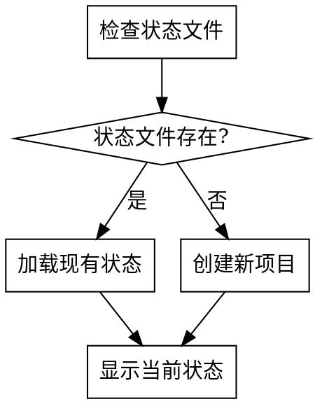

# Writing Workflow Plugin Implementation Plan

> **For agentic workers:** REQUIRED: Use superpowers:subagent-driven-development (if subagents available) or superpowers:executing-plans to implement this plan. Steps use checkbox (`- [ ]`) syntax for tracking.

**Goal:** 创建一个完整的Claude插件，实现AI辅助小说创作的端到端工作流

**Architecture:** 采用多Skill组合架构，每个工作流阶段作为独立skill，通过主协调skill管理流程。使用分层文件存储管理上下文，支持灵活的阶段选择和自动质量检查。

**Tech Stack:** Claude Plugin System, Skills, WebSearch, AskUserQuestion, File Storage

---

## File Structure

```
D:/AI/agent/claude/plugin/plugin/writing-workflow/
├── .claude-plugin/
│   ├── plugin.json
│   └── marketplace.json
├── skills/
│   ├── using-writing-workflow/SKILL.md
│   ├── platform-research/SKILL.md
│   ├── genre-selection/SKILL.md
│   ├── novel-confirmation/SKILL.md
│   ├── creation-planning/SKILL.md
│   ├── outline-writing/SKILL.md
│   ├── chapter-outline/SKILL.md
│   ├── content-generation/SKILL.md
│   └── quality-review/SKILL.md
├── agents/
│   └── novel-creator.md
├── hooks/
│   ├── hooks.json
│   ├── run-hook.cmd
│   └── session-start
└── README.md
```

---

## Chunk 1: 插件基础结构

### Task 1: 创建插件目录结构

**Files:**
- Create: `D:/AI/agent/claude/plugin/plugin/writing-workflow/` (目录)

- [x] **Step 1: 创建插件根目录和子目录**

```bash
mkdir -p "D:/AI/agent/claude/plugin/plugin/writing-workflow/.claude-plugin"
mkdir -p "D:/AI/agent/claude/plugin/plugin/writing-workflow/skills/using-writing-workflow"
mkdir -p "D:/AI/agent/claude/plugin/plugin/writing-workflow/skills/platform-research"
mkdir -p "D:/AI/agent/claude/plugin/plugin/writing-workflow/skills/genre-selection"
mkdir -p "D:/AI/agent/claude/plugin/plugin/writing-workflow/skills/novel-confirmation"
mkdir -p "D:/AI/agent/claude/plugin/plugin/writing-workflow/skills/creation-planning"
mkdir -p "D:/AI/agent/claude/plugin/plugin/writing-workflow/skills/outline-writing"
mkdir -p "D:/AI/agent/claude/plugin/plugin/writing-workflow/skills/chapter-outline"
mkdir -p "D:/AI/agent/claude/plugin/plugin/writing-workflow/skills/content-generation"
mkdir -p "D:/AI/agent/claude/plugin/plugin/writing-workflow/skills/quality-review"
mkdir -p "D:/AI/agent/claude/plugin/plugin/writing-workflow/agents"
mkdir -p "D:/AI/agent/claude/plugin/plugin/writing-workflow/hooks"
```

### Task 2: 创建 plugin.json

**Files:**
- Create: `D:/AI/agent/claude/plugin/plugin/writing-workflow/.claude-plugin/plugin.json`

- [x] **Step 1: 创建 plugin.json 文件**

```json
{
  "name": "writing-workflow",
  "description": "AI辅助小说创作工作流：从平台调研到正文生成的端到端解决方案",
  "version": "1.0.0",
  "author": {
    "name": "User",
    "email": "user@example.com"
  },
  "keywords": ["novel", "writing", "workflow", "creative-writing", "ai-assisted"]
}
```

### Task 3: 创建 marketplace.json

**Files:**
- Create: `D:/AI/agent/claude/plugin/plugin/writing-workflow/.claude-plugin/marketplace.json`

- [x] **Step 1: 创建 marketplace.json 文件**

```json
{
  "name": "writing-workflow-market",
  "description": "小说创作工作流插件市场",
  "owner": {
    "name": "User"
  },
  "plugins": [
    {
      "name": "writing-workflow",
      "description": "AI辅助小说创作工作流",
      "version": "1.0.0",
      "source": "./"
    }
  ]
}
```

### Task 4: 创建 README.md

**Files:**
- Create: `D:/AI/agent/claude/plugin/plugin/writing-workflow/README.md`

- [x] **Step 1: 创建 README.md 文件**

```markdown
# Writing Workflow Plugin

AI辅助小说创作工作流插件，实现从平台调研到正文生成的端到端解决方案。

## 安装

```bash
# 添加marketplace
/plugin marketplace add <marketplace-url>

# 安装插件
/plugin install writing-workflow
```

## 使用

开始工作流：请求使用 `writing-workflow` skill

## 工作流阶段

1. **平台调研** - 分析目标平台数据，推荐适合的发布平台
2. **题材选择** - 分析热门和潜力题材，选择创作方向
3. **作品确认** - 确定作品书名、简介等基本信息
4. **创作规划** - 制定篇幅、发布频率等创作计划
5. **大纲生成** - 生成世界观、人物、情节大纲
6. **章节细纲** - 生成详细的章节细纲
7. **正文生成** - 按章节生成正文内容
8. **质量检查** - 自动质量审查，包含AI痕迹消除

## 特性

- 基于实时数据分析，不捏造数据
- 多阶段质量检查
- AI痕迹消除
- 上下文智能管理
- 灵活的阶段选择
- 所有决策用户确认

## 支持的平台

- 起点中文网
- 番茄小说
- 晋江文学城
- 自定义扩展

## 项目结构

创作过程中会生成以下文件结构：

```
novel-project/
├── workflow-state.json       # 工作流状态
├── 01-platform-research.md   # 平台调研报告
├── 02-genre-analysis.md      # 题材分析报告
├── 03-novel-info.md          # 作品信息
├── 04-creation-plan.md       # 创作规划
├── 05-outline.md             # 作品大纲
├── 06-chapter-outlines/      # 章节细纲
├── 07-content/               # 正文内容
├── 08-characters/            # 人物设定
├── 09-worldbuilding/         # 世界观设定
└── 10-reviews/               # 审查报告
```

## License

MIT
```

---

## Chunk 2: Hooks 和 Agents 配置

### Task 5: 创建 hooks.json

**Files:**
- Create: `D:/AI/agent/claude/plugin/plugin/writing-workflow/hooks/hooks.json`

- [x] **Step 1: 创建 hooks.json 文件**

```json
{
  "hooks": {
    "SessionStart": [
      {
        "matcher": "startup|resume|clear|compact",
        "hooks": [
          {
            "type": "command",
            "command": "\"${CLAUDE_PLUGIN_ROOT}/hooks/run-hook.cmd\" session-start",
            "async": false
          }
        ]
      }
    ]
  }
}
```

### Task 6: 创建 run-hook.cmd

**Files:**
- Create: `D:/AI/agent/claude/plugin/plugin/writing-workflow/hooks/run-hook.cmd`

- [x] **Step 1: 创建 run-hook.cmd 文件**

```batch
@echo off
REM Writing Workflow Plugin Hook Runner
REM Usage: run-hook.cmd <hook-name>

set SCRIPT_PATH=%~dp0%~1
if exist "%SCRIPT_PATH%" (
    call "%SCRIPT_PATH%"
)
```

### Task 7: 创建 session-start

**Files:**
- Create: `D:/AI/agent/claude/plugin/plugin/writing-workflow/hooks/session-start`

- [x] **Step 1: 创建 session-start 文件**

```bash
#!/bin/bash
# Writing Workflow Plugin Session Start Hook
echo "=========================================="
echo "Writing Workflow Plugin loaded."
echo "Use 'writing-workflow' skill to start."
echo "=========================================="
```

### Task 8: 创建 novel-creator.md agent

**Files:**
- Create: `D:/AI/agent/claude/plugin/plugin/writing-workflow/agents/novel-creator.md`

- [x] **Step 1: 创建 novel-creator.md 文件**

```markdown
---
name: novel-creator
description: 子agent用于并行处理小说创作任务
---

# Novel Creator Agent

用于并行处理以下任务：
- 多章节细纲生成
- 多章节正文生成
- 并行质量检查

## 能力
- 读取项目文件
- 生成内容
- 执行质量检查

## 限制
- 不能修改工作流状态
- 不能与用户交互
- 必须返回执行结果给主agent

## 使用场景

当主agent需要并行处理多个独立任务时，可以分发任务给此agent：

1. **批量细纲生成**：同时生成多个章节的细纲
2. **批量正文生成**：同时生成多个章节的正文
3. **并行质量检查**：同时进行多个维度的质量检查

## 输入格式

```json
{
  "task_type": "chapter_outline|content_generation|quality_review",
  "chapter_range": [1, 10],
  "context_files": ["outline.md", "characters.md"],
  "output_dir": "path/to/output"
}
```

## 输出格式

```json
{
  "status": "success|failure",
  "files_created": ["chapter-001.md", "chapter-002.md"],
  "errors": []
}
```
```

---

## Chunk 3: 主入口 Skill

### Task 9: 创建 using-writing-workflow Skill

**Files:**
- Create: `D:/AI/agent/claude/plugin/plugin/writing-workflow/skills/using-writing-workflow/SKILL.md`

- [x] **Step 1: 创建 using-writing-workflow SKILL.md 文件**

```markdown
---
name: using-writing-workflow
description: Use when starting novel creation workflow - manages the entire writing process from platform research to content generation
---

<SUBAGENT-STOP>
If you were dispatched as a subagent to execute a specific task, skip this skill.
</SUBAGENT-STOP>

# Using Writing Workflow

AI辅助小说创作工作流的主入口。管理整个创作流程，协调各阶段skill的执行。

## 触发条件

用户请求开始小说创作工作流时触发。关键词包括：
- "开始小说创作"
- "写作工作流"
- "创作小说"
- "writing-workflow"

## 工作流状态管理

工作流状态保存在 `novel-project/workflow-state.json`：

```json
{
  "current_stage": "platform_research",
  "completed_stages": [],
  "project_info": {
    "work_type": null,
    "platform": null,
    "genre": null,
    "title": null
  },
  "files": {},
  "statistics": {
    "total_chapters": 0,
    "total_words": 0,
    "last_updated": null
  }
}
```

## 阶段定义

| 阶段ID | 阶段名称 | 对应Skill |
|--------|----------|-----------|
| work_type_selection | 作品类型选择 | 内置处理 |
| platform_research | 平台调研 | platform-research |
| genre_selection | 题材选择 | genre-selection |
| novel_confirmation | 作品确认 | novel-confirmation |
| creation_planning | 创作规划 | creation-planning |
| outline_writing | 大纲生成 | outline-writing |
| chapter_outline | 章节细纲 | chapter-outline |
| content_generation | 正文生成 | content-generation |

## 执行流程

### 1. 初始化检查



### 2. 主循环

```
while (用户未退出) {
    显示当前阶段和可选操作
    获取用户选择
    执行对应操作
    更新工作流状态
    检查是否需要质量审查
}
```

### 3. 用户交互

每次阶段完成后，使用AskUserQuestion确认下一步：

```
当前阶段：[阶段名称] 已完成

可选操作：
1. 继续下一阶段
2. 重新执行当前阶段
3. 跳到指定阶段
4. 查看当前进度
5. 保存并退出
```

## 阶段跳转规则

- **顺序执行**：默认按阶段顺序执行
- **跳过阶段**：用户可选择跳过非关键阶段
- **重新执行**：用户可重新执行任意已完成阶段
- **依赖检查**：跳转到某阶段前检查其依赖是否满足

## 依赖关系

```
work_type_selection
    └── platform_research
            └── genre_selection
                    └── novel_confirmation
                            └── creation_planning
                                    └── outline_writing
                                            └── chapter_outline
                                                    └── content_generation
```

## 文件管理

### 创建项目目录

```bash
mkdir -p novel-project/06-chapter-outlines
mkdir -p novel-project/07-content
mkdir -p novel-project/08-characters
mkdir -p novel-project/09-worldbuilding
mkdir -p novel-project/10-reviews/quality-reports
```

### 状态更新

每次阶段完成后更新 `workflow-state.json`：
- 添加到 `completed_stages`
- 更新 `current_stage`
- 更新 `project_info` 相关字段
- 更新 `files` 映射
- 更新 `last_updated` 时间戳

## 错误处理

| 错误类型 | 处理方式 |
|----------|----------|
| 状态文件损坏 | 提示用户重建或手动修复 |
| 阶段执行失败 | 提供重试/跳过/退出选项 |
| 文件读写错误 | 检查权限，提供解决方案 |
| 上下文超限 | 触发上下文压缩机制 |

## 示例对话

```
AI: 欢迎使用小说创作工作流！

检测到已有项目：[项目名称]
当前阶段：大纲生成
已完成：平台调研、题材选择、作品确认、创作规划

请选择：
1. 继续大纲生成
2. 查看项目详情
3. 重新执行某阶段
4. 开始新项目

用户: 1

AI: 正在调用 outline-writing skill...
[执行大纲生成]
```

## 注意事项

- 所有决策必须与用户确认
- 阶段间数据通过文件传递
- 质量检查在关键节点自动触发
- 支持断点续传，可随时保存退出
```

---

## Chunk 4: 平台调研 Skill

### Task 10: 创建 platform-research Skill

**Files:**
- Create: `D:/AI/agent/claude/plugin/plugin/writing-workflow/skills/platform-research/SKILL.md`

- [x] **Step 1: 创建 platform-research SKILL.md 文件**

```markdown
---
name: platform-research
description: Use when user needs to research and select a novel publishing platform - analyzes platform data, user demographics, and revenue models
---

# Platform Research Skill

调研小说发布平台，分析热门题材、用户画像、盈利模式，为用户推荐合适的发布平台。

## 触发条件

- 用户选择作品类型后
- 用户明确请求平台调研
- 工作流进入 platform_research 阶段

## 支持的平台

| 平台 | 类型 | 特点 |
|------|------|------|
| 起点中文网 | 付费阅读 | 男频为主，玄幻/都市热门 |
| 番茄小说 | 免费阅读 | 流量大，广告分成模式 |
| 晋江文学城 | 女性向 | 女频为主，言情/耽美热门 |

## 执行流程

### 1. 确认作品类型

使用AskUserQuestion确认作品类型：

```
请选择您的作品类型：
1. 长篇小说（50万字以上）
2. 中篇小说（10-50万字）
3. 短篇小说（10万字以下）
4. 小故事/短篇集
```

### 2. 执行平台调研

使用WebSearch搜索各平台数据：

**搜索关键词模板**：
- "[平台名称] 2026 热门题材 排行榜"
- "[平台名称] 用户画像 读者分析"
- "[平台名称] 盈利模式 付费方式"
- "[平台名称] 新人作者 建议"

### 3. 分析平台数据

对每个平台分析以下维度：

| 维度 | 分析内容 |
|------|----------|
| 热门题材 | 当前最受欢迎的作品类型 |
| 用户画像 | 读者年龄、性别、地域分布 |
| 盈利模式 | 付费方式、分成比例 |
| 竞争程度 | 红海/蓝海判断 |
| 新人友好度 | 对新作者的扶持政策 |

### 4. 生成调研报告

输出文件：`novel-project/01-platform-research.md`

```markdown
# 平台调研报告

## 调研信息
- 调研时间：[当前日期]
- 作品类型：[用户选择的类型]

## 平台分析

### 起点中文网

#### 热门题材
[基于搜索结果的分析]

#### 用户画像
[基于搜索结果的分析]

#### 盈利模式
[基于搜索结果的分析]

#### 竞争程度
[红海/蓝海分析]

#### 推荐指数
★★★★☆

### 番茄小说
[同上结构]

### 晋江文学城
[同上结构]

## 综合推荐

基于您的作品类型[类型]，推荐平台排序：

1. **[平台名称]** - [推荐理由]
2. **[平台名称]** - [推荐理由]
3. **[平台名称]** - [推荐理由]

## 数据来源
- [来源1标题](URL)
- [来源2标题](URL)
- ...
```

### 5. 用户确认

使用AskUserQuestion让用户选择平台：

```
基于调研结果，推荐以下平台：

1. 起点中文网（推荐）- 玄幻题材首选，付费阅读模式成熟
2. 番茄小说 - 流量大，适合快节奏作品
3. 晋江文学城 - 女性向作品首选
4. 其他平台 - 请手动输入

请选择您的目标平台：
```

### 6. 更新工作流状态

更新 `workflow-state.json`：
```json
{
  "current_stage": "genre_selection",
  "completed_stages": ["platform_research"],
  "project_info": {
    "work_type": "长篇小说",
    "platform": "起点中文网"
  },
  "files": {
    "platform_research": "novel-project/01-platform-research.md"
  }
}
```

## 数据真实性要求

**必须遵守**：
- 所有数据必须来自WebSearch实时搜索
- 不捏造不存在的数据
- 每个数据点必须标注来源URL
- 如果搜索失败，明确告知用户

**搜索失败处理**：
```
AI: 抱歉，无法获取[平台名称]的最新数据。

可能原因：
1. 网络连接问题
2. 搜索服务暂时不可用

请选择：
1. 重试搜索
2. 使用预设数据（可能不是最新）
3. 跳过此平台
4. 手动输入平台信息
```

## 质量检查

调研报告生成后，执行自检：

| 检查项 | 要求 |
|--------|------|
| 数据来源 | 每个平台至少3个数据来源 |
| 时效性 | 数据必须是近期的 |
| 完整性 | 所有分析维度都已覆盖 |
| 客观性 | 不偏向任何平台 |

## 示例输出

```
AI: 正在调研起点中文网...
[WebSearch] 搜索"起点中文网 2026 热门题材"
[WebSearch] 搜索"起点中文网 用户画像"

AI: 正在调研番茄小说...
[WebSearch] 搜索"番茄小说 2026 热门题材"
...

AI: 调研完成！生成报告：novel-project/01-platform-research.md

基于调研结果，我推荐：
1. 起点中文网 - 您选择的玄幻题材在起点有成熟的读者群体
2. 番茄小说 - 免费模式流量大，适合新人起步

请选择您的目标平台：
```
```

---

## Chunk 5: 题材选择 Skill

### Task 11: 创建 genre-selection Skill

**Files:**
- Create: `D:/AI/agent/claude/plugin/plugin/writing-workflow/skills/genre-selection/SKILL.md`

- [x] **Step 1: 创建 genre-selection SKILL.md 文件**

```markdown
---
name: genre-selection
description: Use when user needs to select a genre for their novel - analyzes hot and potential genres based on platform data
---

# Genre Selection Skill

基于平台调研结果，分析热门和潜力题材，帮助用户选择合适的创作题材。

## 触发条件

- 平台选择完成后
- 用户明确请求题材分析
- 工作流进入 genre_selection 阶段

## 前置依赖

- workflow-state.json 中 platform 字段已设置
- 01-platform-research.md 文件存在

## 执行流程

### 1. 加载平台信息

读取 `novel-project/workflow-state.json` 获取：
- 目标平台
- 作品类型

读取 `novel-project/01-platform-research.md` 获取平台调研数据。

### 2. 执行题材调研

使用WebSearch搜索平台题材数据：

**搜索关键词模板**：
- "[平台名称] [年份] 热门题材 排行榜"
- "[平台名称] 潜力题材 蓝海"
- "[平台名称] [题材类型] 读者分析"
- "[平台名称] 新人作者 题材建议"

### 3. 分析题材类型

#### 红海题材分析

红海题材：竞争激烈但流量大

| 分析维度 | 内容 |
|----------|------|
| 热度排名 | 当前热门程度 |
| 竞争程度 | 作品数量、作者数量 |
| 成功案例 | 近期爆款作品 |
| 入门难度 | 新人突围难度 |
| 盈利潜力 | 平均收益水平 |

#### 蓝海题材分析

蓝海题材：竞争小但潜力大

| 分析维度 | 内容 |
|----------|------|
| 增长趋势 | 读者增长速度 |
| 作品缺口 | 供需比分析 |
| 读者粘性 | 付费意愿、追更率 |
| 成功概率 | 新人成功案例 |

### 4. 生成题材分析报告

输出文件：`novel-project/02-genre-analysis.md`

```markdown
# 题材分析报告

## 基本信息
- 目标平台：[平台名称]
- 作品类型：[类型]
- 分析时间：[日期]

## 红海题材分析

### [题材名称]
- 热度指数：★★★★★
- 竞争程度：激烈
- 新人友好度：★★☆☆☆
- 成功案例：《[作品名]》
- 突围建议：[具体建议]

### [题材名称]
[同上结构]

## 蓝海题材分析

### [题材名称]
- 潜力指数：★★★★☆
- 作品缺口：大
- 读者粘性：高
- 成功概率：中等
- 创作建议：[具体建议]

### [题材名称]
[同上结构]

## 题材推荐

基于您的目标平台和作品类型，推荐以下题材：

### 首选推荐
**[题材名称]**
- 推荐理由：[详细说明]
- 预期表现：[预估]

### 备选推荐
1. **[题材名称]** - [简要说明]
2. **[题材名称]** - [简要说明]
3. **[题材名称]** - [简要说明]

## 数据来源
- [来源1标题](URL)
- [来源2标题](URL)
```

### 5. 用户确认

使用AskUserQuestion让用户选择题材：

```
基于[平台名称]的分析，推荐以下题材：

红海题材（竞争激烈但流量大）：
1. 玄幻 - 热度最高，但竞争激烈
2. 都市 - 稳定流量，新人有机会

蓝海题材（竞争小有潜力）：
3. [题材] - 增长快，作品缺口大
4. [题材] - 读者粘性高

请选择您的创作题材：
```

### 6. 更新工作流状态

```json
{
  "current_stage": "novel_confirmation",
  "completed_stages": ["platform_research", "genre_selection"],
  "project_info": {
    "work_type": "长篇小说",
    "platform": "起点中文网",
    "genre": "玄幻"
  },
  "files": {
    "platform_research": "novel-project/01-platform-research.md",
    "genre_analysis": "novel-project/02-genre-analysis.md"
  }
}
```

## 题材组合建议

对于有经验的作者，可以建议题材组合：

```
您选择的[主题材]可以结合以下元素增加差异化：

1. [元素1] - [结合效果]
2. [元素2] - [结合效果]
3. [元素3] - [结合效果]

是否要添加这些元素？
```

## 注意事项

- 所有数据必须来自实时搜索
- 不推荐违法违规题材
- 考虑用户的创作能力匹配
- 提供题材学习资源链接
```

---

## Chunk 6: 作品确认 Skill

### Task 12: 创建 novel-confirmation Skill

**Files:**
- Create: `D:/AI/agent/claude/plugin/plugin/writing-workflow/skills/novel-confirmation/SKILL.md`

- [x] **Step 1: 创建 novel-confirmation SKILL.md 文件**

```markdown
---
name: novel-confirmation
description: Use when user needs to confirm novel details - generates book titles, synopses, and cover prompts
---

# Novel Confirmation Skill

基于平台和题材分析，生成作品选项，确定作品基本信息。

## 触发条件

- 题材选择完成后
- 用户明确请求作品确认
- 工作流进入 novel_confirmation 阶段

## 前置依赖

- workflow-state.json 中 platform 和 genre 字段已设置
- 01-platform-research.md 和 02-genre-analysis.md 存在

## 执行流程

### 1. 加载上下文

读取以下文件：
- `novel-project/workflow-state.json`
- `novel-project/01-platform-research.md`
- `novel-project/02-genre-analysis.md`

### 2. 细分领域分析

使用WebSearch搜索细分领域数据：

**搜索关键词**：
- "[平台名称] [题材] 细分类型"
- "[题材] 读者偏好 2026"
- "[题材] 热门元素 梗"

### 3. 生成作品选项

生成5个不同的作品选项，每个包含：

| 元素 | 说明 |
|------|------|
| 书名 | 吸引目标读者的标题 |
| 一句话简介 | 20字以内的核心卖点 |
| 详细简介 | 100-200字的故事梗概 |
| 封面提示词 | AI生成封面用的提示词 |
| 差异化卖点 | 与同类作品的区别 |

### 4. 展示选项

使用AskUserQuestion展示选项：

```
基于[平台]的[题材]分析，为您生成以下作品选项：

选项1：《[书名]》
一句话：[一句话简介]
卖点：[差异化卖点]

选项2：《[书名]》
一句话：[一句话简介]
卖点：[差异化卖点]

...（共5个选项）

请选择您最感兴趣的作品方向：
1. 选项1
2. 选项2
3. 选项3
4. 选项4
5. 选项5
6. 重新生成
7. 自定义输入
```

### 5. 确定主选和备选

用户选择后，确认主选方案：

```
您选择了：《[书名]》

是否需要设置备选方案？
备选方案可以在主方案创作遇到瓶颈时提供灵感。

1. 不需要备选
2. 设置备选（从其他选项中选择）
```

### 6. 生成作品信息文件

输出文件：`novel-project/03-novel-info.md`

```markdown
# 作品信息

## 基本信息
- 书名：[书名]
- 作者：[待填写]
- 类型：[作品类型]
- 平台：[目标平台]
- 题材：[题材分类]
- 创建时间：[日期]

## 简介

### 一句话简介
[20字以内的核心卖点]

### 详细简介
[100-200字的故事梗概]

## 封面提示词

用于AI生成封面：
```
[详细的封面生成提示词，包含风格、元素、色调等]
```

## 差异化分析

### 目标读者
[基于平台用户画像的目标读者描述]

### 竞品对比
| 对比项 | 本作品 | 同类作品 |
|--------|--------|----------|
| [维度1] | [特点] | [常规做法] |
| [维度2] | [特点] | [常规做法] |

### 核心卖点
1. [卖点1]
2. [卖点2]
3. [卖点3]

## 备选方案

### 备选1：《[书名]》
- 简介：[简要说明]
- 适用场景：[什么情况下可以切换到此方案]

### 备选2：《[书名]》
[同上结构]

## 创作方向确认

- [ ] 书名确认
- [ ] 简介确认
- [ ] 封面方向确认
- [ ] 目标读者确认
```

### 7. 更新工作流状态

```json
{
  "current_stage": "creation_planning",
  "completed_stages": ["platform_research", "genre_selection", "novel_confirmation"],
  "project_info": {
    "work_type": "长篇小说",
    "platform": "起点中文网",
    "genre": "玄幻",
    "title": "[书名]"
  },
  "files": {
    "platform_research": "novel-project/01-platform-research.md",
    "genre_analysis": "novel-project/02-genre-analysis.md",
    "novel_info": "novel-project/03-novel-info.md"
  }
}
```

## 书名生成规则

### 好书名特点
1. 朗朗上口，易于记忆
2. 体现作品核心卖点
3. 符合目标平台风格
4. 有辨识度，不与热门作品重名

### 不同题材书名风格

| 题材 | 书名风格 | 示例 |
|------|----------|------|
| 玄幻 | 大气磅礴 | 《万古神帝》 |
| 都市 | 贴近生活 | 《重生之财源滚滚》 |
| 言情 | 唯美浪漫 | 《何以笙箫默》 |
| 悬疑 | 引人入胜 | 《心理罪》 |

## 简介撰写原则

1. **开头抓人**：第一句话就要吸引读者
2. **设置悬念**：不要剧透，但要暗示精彩
3. **突出卖点**：展示作品的独特之处
4. **控制长度**：100-200字为宜
```

---

## Chunk 7: 创作规划 Skill

### Task 13: 创建 creation-planning Skill

**Files:**
- Create: `D:/AI/agent/claude/plugin/plugin/writing-workflow/skills/creation-planning/SKILL.md`

- [x] **Step 1: 创建 creation-planning SKILL.md 文件**

```markdown
---
name: creation-planning
description: Use when user needs to plan novel creation - defines length, update schedule, and outline guidelines
---

# Creation Planning Skill

制定创作规划，明确小说篇幅、发布频率、大纲生成指导原则。

## 触发条件

- 作品确认完成后
- 用户明确请求创作规划
- 工作流进入 creation_planning 阶段

## 前置依赖

- workflow-state.json 中 title 字段已设置
- 03-novel-info.md 存在

## 执行流程

### 1. 确认小说篇幅

使用AskUserQuestion确认：

```
请选择您的小说篇幅：

1. 长篇小说（100万字以上）
   - 适合：玄幻、仙侠等需要世界观展开的题材
   - 建议：分多卷，每卷20-30万字

2. 中长篇小说（50-100万字）
   - 适合：都市、言情等题材
   - 建议：单卷或双卷结构

3. 中篇小说（20-50万字）
   - 适合：悬疑、短篇故事等
   - 建议：紧凑结构，主线清晰

4. 短篇小说（20万字以下）
   - 适合：小故事、试水作品
   - 建议：聚焦单一冲突

请选择：
```

### 2. 确认发布频率

```
请选择您的发布频率：

1. 每日双更（推荐）
   - 每章2000-3000字
   - 适合新人积累读者

2. 每日三更
   - 每章2000-3000字
   - 需要充足的存稿

3. 每日一更
   - 每章3000-5000字
   - 适合质量优先的策略

4. 每周一更
   - 每章5000-10000字
   - 适合短篇或试水

请选择：
```

### 3. 确认章节长度

```
请选择您的章节长度：

1. 标准章节（2000-3000字）
   - 适合移动端阅读
   - 便于每日更新

2. 长章节（3000-5000字）
   - 内容更完整
   - 减少章节断点

3. 自定义
   - 请输入目标字数：

请选择：
```

### 4. 大纲生成指导

确认大纲生成的指导原则：

```
大纲生成指导原则：

1. 节奏控制
   - 爽点频率：每3-5章一个爽点
   - 高潮间隔：每卷一个大高潮
   - 铺垫比例：20%铺垫 + 80%推进

2. 人物发展
   - 主角成长线：[基于题材的建议]
   - 配角出场频率：主要配角每5章出场
   - 感情线进度：[基于题材的建议]

3. 世界观展开
   - 信息释放：循序渐进，避免信息倾倒
   - 地图扩展：随剧情逐步开放新地图
   - 力量体系：[基于题材的建议]

是否接受以上指导原则？
1. 接受
2. 调整（请说明需要调整的部分）
```

### 5. 生成创作规划文件

输出文件：`novel-project/04-creation-plan.md`

```markdown
# 创作规划

## 基本信息
- 书名：[书名]
- 目标平台：[平台]
- 题材：[题材]
- 规划时间：[日期]

## 篇幅规划

### 总体目标
- 目标字数：[字数]万字
- 预计卷数：[卷数]卷
- 预计章节：[章数]章

### 分卷规划
| 卷次 | 卷名 | 字数目标 | 核心内容 |
|------|------|----------|----------|
| 第一卷 | [卷名] | [字数]万 | [核心内容概述] |
| 第二卷 | [卷名] | [字数]万 | [核心内容概述] |
| ... | ... | ... | ... |

## 发布规划

### 更新频率
- 频率：[每日X更]
- 章节长度：[字数]字/章
- 日更字数：[字数]字

### 发布时间
- 第一更：[时间]
- 第二更：[时间]
- [其他更新时间]

## 大纲生成指导

### 节奏控制
- 爽点频率：每[X]章一个爽点
- 高潮间隔：每卷[X]个大高潮
- 铺垫比例：[X]%铺垫 + [X]%推进

### 人物发展
- 主角成长线：[具体描述]
- 配角出场频率：[频率]
- 感情线进度：[具体描述]

### 世界观展开
- 信息释放原则：[原则]
- 地图扩展计划：[计划]
- 力量体系设计：[设计原则]

## 质量标准

### 内容质量
- 情节连贯性：无逻辑漏洞
- 人物一致性：行为符合人设
- 文风统一性：符合平台用户偏好

### 更新质量
- 准时更新：不无故断更
- 字数达标：每章达到目标字数
- 存稿管理：保持[X]章存稿

## 里程碑

| 阶段 | 目标 | 预计完成时间 |
|------|------|--------------|
| 大纲完成 | 完成详细大纲 | [日期] |
| 细纲完成 | 完成前[X]章细纲 | [日期] |
| 首发准备 | 完成[X]章正文 | [日期] |
| 正式发布 | 开始连载 | [日期] |
| 第一卷完成 | 完成[X]万字 | [日期] |
```

### 6. 更新工作流状态

```json
{
  "current_stage": "outline_writing",
  "completed_stages": ["platform_research", "genre_selection", "novel_confirmation", "creation_planning"],
  "project_info": {
    "work_type": "长篇小说",
    "platform": "起点中文网",
    "genre": "玄幻",
    "title": "[书名]",
    "target_words": 1000000,
    "update_frequency": "每日双更"
  },
  "files": {
    "platform_research": "novel-project/01-platform-research.md",
    "genre_analysis": "novel-project/02-genre-analysis.md",
    "novel_info": "novel-project/03-novel-info.md",
    "creation_plan": "novel-project/04-creation-plan.md"
  }
}
```

## 规划调整机制

创作过程中可根据实际情况调整规划：

```
检测到以下情况，建议调整创作规划：

1. 实际字数与规划偏差超过20%
2. 读者反馈节奏问题
3. 剧情发展需要扩展/压缩

是否需要调整规划？
1. 调整篇幅
2. 调整更新频率
3. 调整节奏设置
4. 暂不调整
```
```

---

## Chunk 8: 大纲生成 Skill

### Task 14: 创建 outline-writing Skill

**Files:**
- Create: `D:/AI/agent/claude/plugin/plugin/writing-workflow/skills/outline-writing/SKILL.md`

- [x] **Step 1: 创建 outline-writing SKILL.md 文件**

```markdown
---
name: outline-writing
description: Use when user needs to create novel outline - generates worldbuilding, characters, and plot structure
---

# Outline Writing Skill

生成作品大纲，包括世界观设定、人物设定、情节主线、分卷大纲。

## 触发条件

- 创作规划完成后
- 用户明确请求大纲生成
- 工作流进入 outline_writing 阶段

## 前置依赖

- workflow-state.json 中 creation_planning 阶段已完成
- 04-creation-plan.md 存在

## 执行流程

### 1. 加载上下文

读取以下文件：
- `novel-project/workflow-state.json`
- `novel-project/03-novel-info.md`
- `novel-project/04-creation-plan.md`

### 2. 生成世界观设定

创建 `novel-project/09-worldbuilding/world-settings.md`：

```markdown
# 世界观设定

## 世界概述
[世界的基本描述]

## 时代背景
[故事发生的时代背景]

## 地理环境

### 主要区域
| 区域名称 | 特点 | 主要势力 |
|----------|------|----------|
| [区域1] | [描述] | [势力] |
| [区域2] | [描述] | [势力] |

### 重要地点
1. **[地点名]**
   - 位置：[位置描述]
   - 特点：[特点描述]
   - 剧情作用：[在故事中的作用]

## 势力体系

### 主要势力
| 势力名称 | 性质 | 实力 | 与主角关系 |
|----------|------|------|------------|
| [势力1] | [性质] | [实力] | [关系] |

### 势力关系图
[势力之间的关系描述]

## 规则法则
[世界的运行规则、禁忌等]
```

### 3. 生成力量体系（如适用）

创建 `novel-project/09-worldbuilding/power-system.md`：

```markdown
# 力量体系

## 体系概述
[力量体系的基本介绍]

## 等级划分

| 等级 | 名称 | 特征 | 代表人物 |
|------|------|------|----------|
| 1 | [等级名] | [特征] | [人物] |
| 2 | [等级名] | [特征] | [人物] |
| ... | ... | ... | ... |

## 晋升条件
[各等级的晋升条件]

## 能力类型
[不同类型的能力介绍]

## 战斗体系
[战斗规则和方式]
```

### 4. 生成人物设定

创建 `novel-project/08-characters/main-characters.md`：

```markdown
# 主要人物设定

## 主角

### 基本信息
- 姓名：[姓名]
- 年龄：[年龄]
- 身份：[初始身份]
- 外貌：[外貌描述]

### 性格特点
[性格描述]

### 背景故事
[背景故事]

### 核心动机
- 表层动机：[表层目标]
- 深层动机：[深层驱动力]

### 成长线
| 阶段 | 状态 | 心理变化 | 能力变化 |
|------|------|----------|----------|
| 开篇 | [状态] | [心理] | [能力] |
| ... | ... | ... | ... |

### 金手指/特殊能力
[主角的特殊优势]

## 主要配角

### [配角名]
- 身份：[身份]
- 与主角关系：[关系]
- 性格：[性格]
- 在故事中的作用：[作用]
- 发展规划：[发展轨迹]
```

创建 `novel-project/08-characters/supporting-characters.md`：

```markdown
# 次要人物设定

## 反派阵营

### [反派名]
- 身份：[身份]
- 动机：[动机]
- 与主角冲突：[冲突点]
- 结局规划：[结局]

## 配角列表

| 姓名 | 身份 | 出场章节 | 作用 | 结局 |
|------|------|----------|------|------|
| [姓名] | [身份] | [章节] | [作用] | [结局] |
```

### 5. 生成主大纲

创建 `novel-project/05-outline.md`：

```markdown
# 作品大纲

## 基本信息
- 书名：[书名]
- 题材：[题材]
- 目标字数：[字数]万字

## 核心设定

### 一句话概述
[整本书的核心故事]

### 核心冲突
[主要矛盾冲突]

### 主题思想
[作品要表达的主题]

## 情节主线

### 开篇设定
- 开篇场景：[场景描述]
- 切入点：[如何吸引读者]
- 核心悬念：[开篇悬念]

### 主线发展
[主线情节的发展脉络]

### 高潮设计
[主要高潮的设计]

### 结局规划
[结局走向]

## 分卷大纲

### 第一卷：[卷名]

#### 卷概述
- 字数目标：[字数]万字
- 核心冲突：[冲突描述]
- 卷末高潮：[高潮描述]

#### 章节规划
| 章节 | 内容概述 | 爽点/悬念 |
|------|----------|-----------|
| 1-5 | [概述] | [爽点] |
| 6-10 | [概述] | [爽点] |
| ... | ... | ... |

#### 人物发展
- 主角：[本卷发展]
- 配角：[本卷发展]

### 第二卷：[卷名]
[同上结构]

## 时间线

| 时间节点 | 事件 | 涉及人物 |
|----------|------|----------|
| [时间] | [事件] | [人物] |
| ... | ... | ... |

## 伏笔设计

| 伏笔 | 埋设章节 | 揭示章节 | 作用 |
|------|----------|----------|------|
| [伏笔] | [章节] | [章节] | [作用] |
```

### 6. 内嵌自检

生成大纲后执行自检：

```
大纲自检报告：

✓ 世界观完整性
  - 主要区域已定义
  - 势力关系清晰
  - 规则法则明确

✓ 人物设定
  - 主角成长线完整
  - 配角作用明确
  - 人物关系清晰

✓ 情节逻辑
  - 主线清晰
  - 冲突合理
  - 高潮设计到位

⚠ 需要确认
  - [某设定]是否符合预期？
```

### 7. 调用质量审查

调用 quality-review skill 进行大纲质量审查。

### 8. 用户确认

使用AskUserQuestion确认大纲：

```
大纲生成完成！

主要内容包括：
- 世界观设定：[简要描述]
- 主角设定：[简要描述]
- 分卷规划：[卷数]卷

请选择：
1. 确认大纲，继续下一步
2. 查看详细大纲
3. 修改部分内容
4. 重新生成大纲
```

### 9. 更新工作流状态

```json
{
  "current_stage": "chapter_outline",
  "completed_stages": [..., "outline_writing"],
  "files": {
    ...
    "outline": "novel-project/05-outline.md",
    "characters": "novel-project/08-characters/",
    "worldbuilding": "novel-project/09-worldbuilding/"
  }
}
```

## 大纲质量标准

| 维度 | 要求 |
|------|------|
| 完整性 | 所有设定文件齐全 |
| 逻辑性 | 无自相矛盾的设定 |
| 可执行性 | 能指导细纲和正文生成 |
| 节奏感 | 爽点分布合理 |
| 差异化 | 有独特的卖点 |
```

---

## Chunk 9: 章节细纲 Skill

### Task 15: 创建 chapter-outline Skill

**Files:**
- Create: `D:/AI/agent/claude/plugin/plugin/writing-workflow/skills/chapter-outline/SKILL.md`

- [x] **Step 1: 创建 chapter-outline SKILL.md 文件**

```markdown
---
name: chapter-outline
description: Use when user needs to create chapter outlines - generates detailed chapter-by-chapter plot outlines
---

# Chapter Outline Skill

生成章节细纲，为正文生成提供详细指导。

## 触发条件

- 大纲确认完成后
- 用户明确请求细纲生成
- 工作流进入 chapter_outline 阶段

## 前置依赖

- workflow-state.json 中 outline_writing 阶段已完成
- 05-outline.md 存在
- 人物设定和世界观文件存在

## 执行流程

### 1. 加载上下文

读取以下文件：
- `novel-project/workflow-state.json`
- `novel-project/05-outline.md`
- `novel-project/08-characters/main-characters.md`
- `novel-project/09-worldbuilding/` 目录下的设定文件

### 2. 确认生成范围

使用AskUserQuestion确认：

```
请选择细纲生成范围：

1. 生成前10章细纲（推荐）
   - 适合首发准备
   - 可随时继续生成

2. 生成第一卷全部细纲
   - 需要较长时间
   - 保证卷内连贯性

3. 自定义章节数
   - 请输入起始和结束章节：

请选择：
```

### 3. 分批生成细纲

按批次生成，每批5章：

```
正在生成第1-5章细纲...
[生成中]

第1-5章细纲生成完成，请确认：
[展示5章细纲概要]

是否继续生成第6-10章？
1. 继续
2. 修改当前细纲
3. 暂停，稍后继续
```

### 4. 细纲模板

每章细纲保存为 `novel-project/06-chapter-outlines/chapter-XXX.md`：

```markdown
# 第X章：[章节名]

## 基本信息
- 所属卷：第X卷
- 字数目标：[字数]字
- 预计爽点：[爽点类型]

## 章节概要
[100-200字的章节概要]

## 详细情节

### 场景一：[场景名]
- 地点：[地点]
- 时间：[时间]
- 出场人物：[人物列表]
- 情节内容：
  [详细描述]

### 场景二：[场景名]
[同上结构]

## 人物出场

| 人物 | 出场方式 | 本章作用 | 情绪状态 |
|------|----------|----------|----------|
| [人物] | [方式] | [作用] | [状态] |

## 关键对话
[需要出现的关键对话或台词]

## 伏笔/呼应

### 本章埋设
- [伏笔内容] - 预计第X章揭示

### 呼应前文
- 呼应第X章：[内容]

## 爽点设计
- 爽点类型：[打脸/升级/装逼/反转等]
- 爽点位置：[场景]
- 爽点铺垫：[如何铺垫]
- 爽点释放：[如何释放]

## 章末钩子
[吸引读者继续阅读的悬念或钩子]

## 注意事项
[写作时需要注意的事项]
```

### 5. 连贯性检查

每批生成后检查：

```
连贯性检查报告：

✓ 与大纲一致性
  - 情节走向符合大纲
  - 人物行为符合设定

✓ 章节间连贯性
  - 时间线连续
  - 场景转换合理
  - 情绪过渡自然

⚠ 发现问题
  - 第X章与第Y章存在[问题]
  - 建议调整：[建议]
```

### 6. 调用质量审查

调用 quality-review skill 进行细纲质量审查。

### 7. 用户确认

每批生成后确认：

```
第X-Y章细纲生成完成！

章节概览：
- 第X章：[章节名] - [一句话概要]
- 第Y章：[章节名] - [一句话概要]

请选择：
1. 确认，继续生成
2. 查看某章详细细纲
3. 修改某章细纲
4. 暂停，稍后继续
```

### 8. 更新工作流状态

```json
{
  "current_stage": "content_generation",
  "completed_stages": [..., "chapter_outline"],
  "statistics": {
    "total_chapters": 10,
    "outlined_chapters": 10
  }
}
```

## 细纲质量标准

| 维度 | 要求 |
|------|------|
| 详细程度 | 能指导正文生成 |
| 一致性 | 与大纲、人物设定一致 |
| 连贯性 | 前后章节连贯 |
| 爽点分布 | 符合节奏规划 |
| 可执行性 | 场景、对话具体 |

## 并行生成优化

当需要生成大量细纲时，可使用Agent工具并行生成：

```
检测到需要生成[X]章细纲，是否使用并行生成？
- 优点：速度更快
- 缺点：可能需要更多后期调整

1. 并行生成
2. 顺序生成（推荐，保证连贯性）
```
```

---

## Chunk 10: 正文生成 Skill

### Task 16: 创建 content-generation Skill

**Files:**
- Create: `D:/AI/agent/claude/plugin/plugin/writing-workflow/skills/content-generation/SKILL.md`

- [x] **Step 1: 创建 content-generation SKILL.md 文件**

```markdown
---
name: content-generation
description: Use when user needs to generate novel content - creates chapter content based on outlines and previous chapters
---

# Content Generation Skill

生成小说正文，确保与大纲、细纲、前文的一致性和连贯性。

## 触发条件

- 细纲生成完成后
- 用户明确请求正文生成
- 工作流进入 content_generation 阶段

## 前置依赖

- workflow-state.json 中 chapter_outline 阶段已完成
- 至少有一章细纲存在
- 人物设定和世界观文件存在

## 执行流程

### 1. 加载上下文

读取以下文件：
- `novel-project/workflow-state.json`
- `novel-project/05-outline.md`（大纲摘要）
- `novel-project/06-chapter-outlines/chapter-XXX.md`（当前章节细纲）
- `novel-project/08-characters/main-characters.md`（人物设定）
- 前3章正文（如存在）

### 2. 确认生成范围

使用AskUserQuestion确认：

```
请选择正文生成范围：

1. 生成下一章（推荐）
   - 逐章生成，保证质量

2. 生成多章
   - 请输入章节范围：

3. 重新生成某章
   - 请输入章节号：

请选择：
```

### 3. 生成正文

按以下步骤生成：

```
正在生成第X章正文...

加载上下文：
- 大纲摘要 ✓
- 本章细纲 ✓
- 人物设定 ✓
- 前3章内容 ✓

生成中...
[生成正文内容]
```

### 4. 正文模板

每章正文保存为 `novel-project/07-content/chapter-XXX.md`：

```markdown
# 第X章 [章节名]

[正文内容]

---

本章字数：[字数]字
累计字数：[累计字数]字
```

### 5. 内嵌自检

生成后自检：

```
正文自检报告：

✓ 字数达标
  - 目标：[目标]字
  - 实际：[实际]字

✓ 与细纲一致性
  - 情节完整
  - 场景覆盖

✓ 人物一致性
  - 行为符合人设
  - 对话风格一致

✓ 前后文连贯
  - 承接自然
  - 无矛盾

⚠ 发现问题
  - [问题描述]
  - 建议：[建议]
```

### 6. 调用质量审查

调用 quality-review skill 进行正文质量审查（包含AI痕迹检查）。

### 7. 用户确认

```
第X章正文生成完成！

章节信息：
- 字数：[字数]字
- 场景数：[数量]
- 出场人物：[人物列表]

请选择：
1. 确认，继续下一章
2. 查看正文内容
3. 修改本章内容
4. 重新生成
5. 暂停，稍后继续
```

### 8. 更新工作流状态

```json
{
  "current_stage": "content_generation",
  "statistics": {
    "total_chapters": 10,
    "completed_chapters": 1,
    "total_words": 3000,
    "last_updated": "[时间戳]"
  }
}
```

## 上下文管理

### 加载策略

| 内容类型 | 加载方式 |
|----------|----------|
| 大纲 | 加载摘要版本 |
| 细纲 | 加载当前章节完整内容 |
| 人物设定 | 加载本章出场人物设定 |
| 前文 | 加载前3章内容 |

### 超限处理

当上下文接近限制时：

```
检测到上下文接近限制，建议：

1. 使用摘要模式
   - 前文使用摘要版本
   - 可能影响连贯性

2. 分段生成
   - 将章节分成多段生成
   - 保证每段质量

3. 清理不必要内容
   - 移除已完成的设定文件
   - 保留核心设定

请选择：
```

## 文风控制

### 平台风格适配

| 平台 | 文风特点 |
|------|----------|
| 起点中文网 | 节奏快、爽点密集、对话多 |
| 番茄小说 | 轻松、快节奏、适合碎片阅读 |
| 晋江文学城 | 细腻、情感丰富、文笔优美 |

### 文风检查

```
文风检查报告：

✓ 符合平台风格
  - [平台]风格特点：[特点]
  - 本章表现：[表现]

✓ 节奏控制
  - 爽点数量：[数量]
  - 节奏评分：[评分]

⚠ 建议
  - [建议内容]
```

## AI痕迹消除

在质量审查阶段自动检查并消除AI痕迹：

| AI痕迹类型 | 检测方法 | 处理方式 |
|------------|----------|----------|
| 句式规整 | 检测句式重复 | 增加变化 |
| 过渡词重复 | 统计过渡词频率 | 替换或删除 |
| 形容词堆砌 | 检测形容词密度 | 精简或替换 |
| 情感直白 | 检测情感表达方式 | 改为细节描写 |
```

---

## Chunk 11: 质量审查 Skill

### Task 17: 创建 quality-review Skill

**Files:**
- Create: `D:/AI/agent/claude/plugin/plugin/writing-workflow/skills/quality-review/SKILL.md`

- [x] **Step 1: 创建 quality-review SKILL.md 文件**

```markdown
---
name: quality-review
description: Use when quality check is needed - reviews content for consistency, style, and AI traces
---

# Quality Review Skill

多维度质量审查，包括一致性检查、文风检查、AI痕迹消除。

## 触发条件

- 大纲生成后（自动）
- 细纲生成后（自动）
- 每章正文生成后（自动）
- 用户明确请求质量审查

## 审查阶段

| 阶段 | 审查重点 | 审查角色 |
|------|----------|----------|
| 大纲 | 世界观完整性、设定逻辑性、节奏合理性 | 架构审查员、节奏审查员、用户画像审查员 |
| 细纲 | 与大纲一致性、章节连贯性 | 情节审查员、连贯性审查员 |
| 正文 | 人物一致性、前后文连贯性、文风、AI痕迹 | 连贯性审查员、人物审查员、文风审查员、AI痕迹审查员 |

## 执行流程

### 1. 确定审查类型

根据触发条件确定审查类型：
- outline_review：大纲审查
- chapter_outline_review：细纲审查
- content_review：正文审查

### 2. 加载审查内容

根据审查类型加载对应文件：
- 大纲审查：05-outline.md, 08-characters/, 09-worldbuilding/
- 细纲审查：06-chapter-outlines/chapter-XXX.md, 05-outline.md
- 正文审查：07-content/chapter-XXX.md, 06-chapter-outlines/, 08-characters/

### 3. 执行审查

#### 大纲审查

```
## 大纲质量审查报告

### 架构审查
✓ 世界观完整性
  - 主要区域定义完整
  - 势力体系清晰
  - 规则法则明确

✓ 设定逻辑性
  - 无自相矛盾
  - 因果关系合理

### 节奏审查
✓ 爽点分布
  - 每5章有爽点
  - 每卷有大高潮

✓ 节奏控制
  - 铺垫与推进比例合理
  - 高潮设计到位

### 用户画像审查
✓ 目标用户匹配
  - 题材符合平台用户偏好
  - 节奏符合目标读者习惯

**总体评分：★★★★☆**

**修改建议：**
1. [建议1]
2. [建议2]
```

#### 细纲审查

```
## 细纲质量审查报告

### 情节审查
✓ 与大纲一致性
  - 情节走向符合大纲规划
  - 人物发展符合设定

✓ 细节完整性
  - 场景描述具体
  - 对话设计合理

### 连贯性审查
✓ 章节间连贯
  - 时间线连续
  - 场景转换自然
  - 情绪过渡流畅

**总体评分：★★★★★**

**无重大问题**
```

#### 正文审查

```
## 正文质量审查报告

### 连贯性审查
✓ 与前文连贯
  - 承接自然
  - 无矛盾冲突

### 人物审查
✓ 人物一致性
  - 行为符合人设
  - 对话风格一致
  - 情绪变化合理

### 文风审查
✓ 平台风格匹配
  - 符合[平台]文风特点
  - 节奏控制得当

### AI痕迹审查

#### 发现的AI痕迹
| 位置 | 问题类型 | 原文 | 建议修改 |
|------|----------|------|----------|
| 第X段 | 情感直白 | "他感到非常愤怒" | "他攥紧拳头，指节泛白" |
| 第Y段 | 形容词堆砌 | "非常美丽、十分动人" | "她的眉眼如画，一笑生花" |

#### AI痕迹评分
- 原始评分：★★★☆☆（中等）
- 优化后评分：★★★★☆（轻微）

**总体评分：★★★★☆**

**优化建议：**
1. [建议1]
2. [建议2]
```

### 4. 生成审查报告

保存到 `novel-project/10-reviews/quality-reports/`：

```markdown
# [审查类型]审查报告

## 基本信息
- 审查时间：[时间]
- 审查对象：[文件名]
- 审查类型：[类型]

## 审查结果

### 通过项
- [项目1] ✓
- [项目2] ✓

### 问题项
- [项目1] ✗
  - 问题描述：[描述]
  - 修改建议：[建议]

## 总体评分
★★★★☆

## 下一步建议
[建议]
```

### 5. 用户确认

```
质量审查完成！

总体评分：★★★★☆

发现[X]个问题，已生成修改建议。

请选择：
1. 查看详细报告
2. 应用修改建议
3. 忽略，继续下一步
4. 手动修改后重新审查
```

## AI痕迹检查详解

### 检测规则

| 痕迹类型 | 检测规则 | 示例 |
|----------|----------|------|
| 句式规整 | 连续3句以上相同句式 | "他做了A。他做了B。他做了C。" |
| 过渡词重复 | 同一段落出现3次以上相同过渡词 | "然后...然后...然后..." |
| 形容词堆砌 | 连续使用"非常"、"十分"等程度副词 | "非常美丽，十分动人" |
| 情感直白 | 直接描述情感而非通过行为表现 | "他感到很伤心" |
| 缺乏细节 | 抽象描述多于具体描写 | "风景很美" vs "远山如黛，近水含烟" |
| 价值观说教 | 过于直白的价值观表达 | "这告诉我们一个道理..." |

### 优化示例

**原文（AI痕迹明显）**：
> 他感到非常愤怒，因为这件事情让他觉得很不公平。他的内心充满了复杂的情绪。

**优化后**：
> 他攥紧了拳头，指节泛白。桌上那杯茶已经凉透了，就像他此刻的心。三年了，他等了三年，换来的却是这样的结果。

## 质量标准

### 大纲质量标准
- 世界观完整，无矛盾
- 人物设定清晰
- 情节逻辑合理
- 节奏规划明确

### 细纲质量标准
- 与大纲一致
- 场景描述具体
- 人物行为合理
- 爽点设计到位

### 正文质量标准
- 与设定一致
- 前后文连贯
- 文风符合平台
- AI痕迹轻微或无
```

---

## Chunk 12: 最终验证

### Task 18: 验证插件结构完整性

**Files:**
- Verify: 所有已创建的文件

- [x] **Step 1: 验证目录结构**

```bash
# 验证所有目录和文件是否存在
ls -la "D:/AI/agent/claude/plugin/plugin/writing-workflow/"
ls -la "D:/AI/agent/claude/plugin/plugin/writing-workflow/.claude-plugin/"
ls -la "D:/AI/agent/claude/plugin/plugin/writing-workflow/skills/"
ls -la "D:/AI/agent/claude/plugin/plugin/writing-workflow/agents/"
ls -la "D:/AI/agent/claude/plugin/plugin/writing-workflow/hooks/"
```

- [x] **Step 2: 验证JSON文件格式**

```bash
# 验证JSON文件格式正确
cat "D:/AI/agent/claude/plugin/plugin/writing-workflow/.claude-plugin/plugin.json"
cat "D:/AI/agent/claude/plugin/plugin/writing-workflow/.claude-plugin/marketplace.json"
cat "D:/AI/agent/claude/plugin/plugin/writing-workflow/hooks/hooks.json"
```

- [x] **Step 3: 验证Skill文件格式**

确保每个SKILL.md文件包含：
- YAML front matter (name, description)
- 详细的skill说明
- 触发条件
- 执行流程

- [x] **Step 4: 创建测试项目目录**

```bash
mkdir -p "D:/AI/agent/claude/plugin/plugin/writing-workflow/test-project"
```

---

## 完成确认

完成所有任务后，插件应该可以通过以下方式安装：

```bash
# 添加marketplace
/plugin marketplace add file:///D:/AI/agent/claude/plugin/plugin/writing-workflow

# 安装插件
/plugin install writing-workflow
```

**Plan complete and saved to `docs/superpowers/plans/2026-03-19-writing-workflow-plugin.md`. Ready to execute?**
