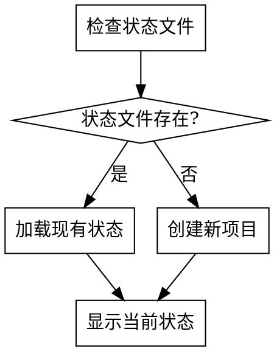
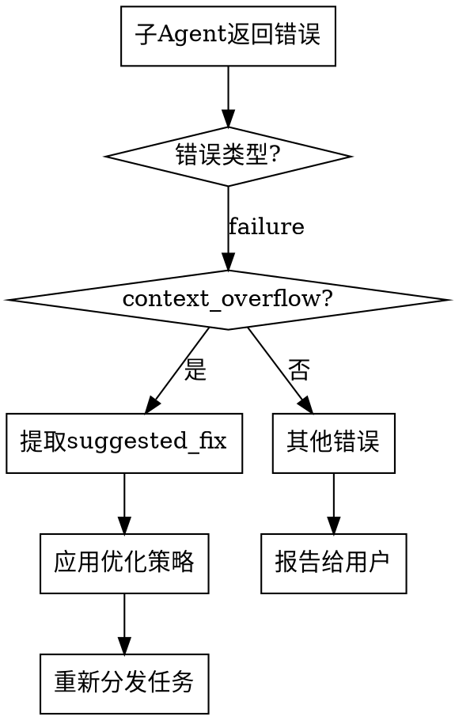

<SUBAGENT-STOP>
If you were dispatched as a subagent to execute a specific task, skip this skill.
</SUBAGENT-STOP>

# Using Writing Workflow

AI辅助小说创作工作流的主入口。管理整个创作流程，协调各阶段skill的执行。

## 触发条件

用户请求开始小说创作工作流时触发。关键词包括：
- "开始小说创作"
- "写作工作流"
- "创作小说"
- "writing-workflow"

## 工作流状态管理

工作流状态保存在 `novel-project/workflow-state.json`：

```json
{
  "current_stage": "work_type_selection",
  "completed_stages": [],
  "project_info": {
    "work_type": null,
    "platform": null,
    "genre": null,
    "title": null
  },
  "files": {},
  "guardrails": {
    "continuity_mode": "strict",
    "latest_passed_chapter": 0,
    "latest_ai_path": null,
    "release_allowed": true,
    "monetization_allowed": true,
    "latest_drift_score": null,
    "latest_context_card": null,
    "latest_continuity_ledger": "novel-project/17-continuity/continuity-ledger.md"
  },
  "statistics": {
    "total_chapters": 0,
    "total_words": 0,
    "last_updated": null
  }
}
```

## 阶段定义

| 阶段ID | 阶段名称 | 对应Skill | 说明 |
|--------|----------|-----------|------|
| work_type_selection | 作品类型选择 | work-type-selection | 选择适合的作品类型 |
| platform_research | 平台调研 | platform-research | 调研平台数据、签约政策 |
| competitor_analysis | 竞品分析 | competitor-analysis | 深度拆解同赛道头部作品 |
| genre_selection | 题材选择 | genre-selection | 选择创作题材 |
| novel_confirmation | 作品确认 | novel-confirmation | 确定作品基本信息 |
| creation_planning | 创作规划 | creation-planning | 制定创作计划 |
| outline_writing | 大纲生成 | outline-writing | 生成世界观和大纲 |
| chapter_outline | 章节细纲 | chapter-outline | 生成章节细纲 |
| content_generation | 正文生成 | content-generation | 生成正文内容（含平台算法适配） |
| human_ai_collaboration | AI合规处理 | human-ai-collaboration | 人机协作流程，确保内容过审 |
| quality_review | 质量审查 | quality-review | 多维度质量审查 |
| launch_strategy | 上架发布 | launch-strategy | 存稿管理、签约、首秀准备 |
| monetization_strategy | 变现策略 | monetization-strategy | VIP/付费卡点/收益优化 |
| opening_optimization | 开篇优化 | opening-optimization | 黄金三章优化（可选） |
| novel_style_learning | 网文风格学习 | novel-style-learning | 学习网文风格（可选） |
| data_monitoring | 数据监控 | data-monitoring | 监控运营数据+数据→内容闭环（发布后） |
| reader_interaction | 读者互动 | reader-interaction | 管理读者关系（发布后） |

## PUA Skill 集成

本工作流集成了 pua skill 进行AI行为监督，在以下情况下自动触发：

### 触发条件
1. **连续失败**：某个阶段执行失败2次以上
2. **用户不满意**：用户表达"再试试"、"换个方法"、"为什么还不行"等情绪
3. **创作卡顿**：生成内容质量明显下降或无法继续
4. **上下文超限**：子agent因上下文问题无法完成任务

### 触发方式
当检测到以上情况时，调用 `pua:pua` skill：

```
检测到创作过程遇到困难，正在启动AI行为监督...
[调用 pua:pua skill]
```

### 监督内容
- 分析失败原因
- 提供优化方案
- 强制AI尝试更多解决方案
- 不允许轻易放弃

### 降级规则（pua Skill 不存在时）

若 `pua:pua` 不可用（未安装 superpowers 或相关插件），**跳过该分支**，改为直接向用户说明。

**非质量关键阶段**（work_type_selection, platform_research, competitor_analysis, genre_selection, novel_confirmation, creation_planning）：
```
当前阶段遇到困难，需要您决定下一步：

1. 重新尝试（Claude 使用不同方式重试）
2. 跳过此阶段，进入下一阶段
3. 退出工作流，稍后继续
```

**质量关键阶段**（outline_writing, chapter_outline, content_generation, quality_review, human_ai_collaboration）：
```
当前阶段遇到困难，需要您决定下一步：

1. 重新尝试（Claude 使用不同方式重试）
2. 手动修改后重新审查
3. 保存当前进度，稍后继续
```

> ⚠️ 质量关键阶段不提供"跳过"选项，与质量门禁规则保持一致。

不抛出错误，不尝试调用不存在的 Skill。

## 执行流程

### 1. 初始化检查



### 2. 主循环

```
while (用户未退出) {
    显示当前阶段和可选操作
    获取用户选择
    执行对应操作
    更新工作流状态
    检查是否需要质量审查
}
```

### 3. 用户交互

每次阶段完成后，使用AskUserQuestion确认下一步：

**非质量关键阶段**（work_type_selection, platform_research, competitor_analysis, genre_selection, novel_confirmation, creation_planning）：
```
当前阶段：[阶段名称] 已完成

可选操作：
1. 继续下一阶段
2. 重新执行当前阶段
3. 跳过此阶段，进入下一阶段
4. 跳到指定阶段
5. 查看当前进度
6. 保存并退出
```

> 💡 以下阶段为**质量关键阶段**，必须通过质量检查才能继续，不可跳过。这是为了确保作品达到平台发布标准。

**质量关键阶段**（outline_writing, chapter_outline, content_generation, quality_review, human_ai_collaboration）：
```
当前阶段：[阶段名称] 已完成

质量检查结果：[通过/未通过]

可选操作：
1. 继续下一阶段（仅质量检查通过时可选）
2. 重新执行当前阶段
3. 查看质量审查报告
4. 手动修改后重新审查
5. 查看当前进度
6. 保存并退出
```

> ⚠️ 质量关键阶段不提供"跳过"选项。必须通过质量检查才能进入下一阶段。
> 唯一例外：短篇用户可跳过 platform_research 和 competitor_analysis。

> ⚠️ 质量门禁最大重试次数：同一阶段连续3次未通过质量检查后，暂停工作流并提示用户：
>
> ```
> 当前阶段已连续3次未通过质量检查。建议：
> 1. 查看历次审查报告，分析共性问题
> 2. 手动大幅修改后重新提交
> 3. 回退到上一阶段（如修改细纲/大纲后重新生成）
> 4. 保存进度，寻求外部帮助后继续
> ```

## 阶段跳转规则

- **顺序执行**：默认按阶段顺序执行
- **跳过阶段**：用户可选择跳过非关键阶段
- **重新执行**：用户可重新执行任意已完成阶段
- **依赖检查**：跳转到某阶段前检查其依赖是否满足

## 依赖关系

```
work_type_selection
    └── platform_research
            ├── competitor_analysis (竞品分析)
            └── genre_selection
                    └── novel_confirmation
                            └── creation_planning
                                    └── outline_writing
                                            └── chapter_outline
                                                    └── content_generation
                                                            ├── human_ai_collaboration (AI合规)
                                                            ├── quality_review (质量审查)
                                                            ├── opening_optimization (前三章优化)
                                                            └── novel_style_learning (风格学习)

发布运营阶段：
content_generation ──┬── launch_strategy (上架发布策略)
                     │       └── monetization_strategy (变现策略)
                     ├── data_monitoring (数据监控+闭环)
                     └── reader_interaction (读者互动)
```

**阶段说明**：
- `competitor_analysis`：平台确定后、题材选择前执行，为选题和写作提供差异化方向
- `human_ai_collaboration`：每章正文生成后自动触发，确保AI合规
- `launch_strategy`：正文存稿达标后执行，制定发布策略
- `monetization_strategy`：上架策略确定后执行，制定变现计划
- `data_monitoring`：作品发布后持续执行，数据异常自动触发内容优化
- `opening_optimization`：前三章完成后自动建议执行
- `novel_style_learning`：可在任何阶段执行
- `reader_interaction`：作品发布后持续执行

## 文件管理

### 创建项目目录

```bash
mkdir -p novel-project/06-chapter-outlines
mkdir -p novel-project/07-content
mkdir -p novel-project/08-characters
mkdir -p novel-project/09-worldbuilding
mkdir -p novel-project/10-reviews/quality-reports
mkdir -p novel-project/11-data-monitoring
mkdir -p novel-project/12-reader-interaction
mkdir -p novel-project/13-creation-logs
mkdir -p novel-project/17-continuity
```

### 状态更新

每次阶段完成后以**增量方式**更新 `workflow-state.json`，只修改该阶段负责的字段，**不整文件替换**，避免丢失其他阶段写入的数据。

增量更新规则：
- `completed_stages`：追加当前阶段 ID（不覆盖已有列表）
- `current_stage`：设为下一阶段 ID
- `project_info`：只更新本阶段写入的字段（如 `platform`、`genre`、`title`），不动其他字段
- `files`：追加本阶段产出的文件路径（如 `"platform_research": "novel-project/01-platform-research.md"`），不动已有映射
- `guardrails`：仅 `human-ai-collaboration` 和 `content-generation` 阶段写入，其他阶段不触碰
- `statistics.last_updated`：每次阶段完成都更新为当前时间戳
- `statistics.total_chapters` / `total_words`：仅 `content-generation` 阶段更新

> ⚠️ 每个阶段的 Skill 文件中只列出该阶段负责的增量字段。执行时读取已有状态，只修改声明字段，其余字段原样保留。

## 正文看护流程

正文生成和质量审查阶段必须执行以下看护链路，目标是减少大纲偏离、细纲偏离和上下文断裂：

```text
大纲阶段：
  生成 continuity story bible（不可变更事实、时间线锚点、人物初始状态、关键伏笔）

细纲阶段：
  为每章生成 chapter context card（本章起点状态、必写场景、禁止偏离项、章末交接状态）

正文阶段：
  先读取 story bible + chapter context card + 前章连续性账本
  再按场景顺序逐段生成，禁止跳过必写场景或随意新增设定

审查阶段：
  先做连续性硬门槛检查，再做人物/文风/平台适配评分
```

### 连续性硬门槛

出现以下任一情况时，正文视为**未通过**，不得继续下一阶段：

1. 场景覆盖率低于 90%
2. 偏离度高于 15%
3. 前后章时间线、地点、人物状态存在硬冲突
4. 本章 context card 中的必写信息缺失
5. 未经说明擅自新增关键设定、人物关系或世界规则

### 允许的有限偏离

以下偏离可以接受，但必须在本章自检和审查报告中解释原因：

- 细节扩写但不改变场景功能
- 衔接过渡补写
- 为增强连贯性添加的微小动作、情绪、环境信息

> 原则：允许“补充”，不允许“改轨”。

## 错误处理

| 错误类型 | 处理方式 |
|----------|----------|
| 状态文件损坏 | 提示用户重建或手动修复 |
| 阶段执行失败 | 提供重试/跳过/退出选项 |
| 文件读写错误 | 检查权限，提供解决方案 |
| 上下文超限 | 触发上下文压缩机制 |

## 子Agent上下文超限处理

当子agent返回 `context_overflow` 错误时，不直接重试，而是优化后重试：

### 处理流程



### 优化策略

1. **减少上下文**：移除 `suggested_fix.reduce_context` 中的可选文件
2. **分批处理**：按 `suggested_fix.split_task.suggested_batches` 分批执行
3. **使用摘要**：将完整文件替换为摘要版本

### 示例代码

```python
# 伪代码示例
def handle_subagent_error(error):
    if error.get("error_type") == "context_overflow":
        fix = error.get("suggested_fix", {})

        # 策略1：减少上下文
        if fix.get("reduce_context"):
            context_files = [f for f in context_files
                           if f not in fix["reduce_context"]]

        # 策略2：分批处理
        if fix.get("split_task"):
            batches = fix["split_task"]["suggested_batches"]
            for batch in batches:
                result = dispatch_to_subagent(batch)
                if result["status"] == "failure":
                    return handle_subagent_error(result)
            return {"status": "success"}

        # 策略3：使用摘要模式
        context_priority = "summary"
        return dispatch_to_subagent(context_priority="summary")

    else:
        # 其他错误报告给用户
        report_error_to_user(error)
```

### 最大重试次数

每种优化策略最多重试2次，超过后报告给用户。

## 示例对话

```
AI: 欢迎使用小说创作工作流！

检测到已有项目：[项目名称]
当前阶段：大纲生成
已完成：平台调研、题材选择、作品确认、创作规划

请选择：
1. 继续大纲生成
2. 查看项目详情
3. 重新执行某阶段
4. 开始新项目

用户: 1

AI: 正在调用 outline-writing skill...
[执行大纲生成]
```

## 强制门禁检查（硬执法）

每个阶段完成后，Coordinator **必须**执行以下 4 级门禁检查。这是结构性约束，Coordinator 不可跳过。

### 门禁检查流程

```
阶段执行完成
    ↓
F1. 文件存在性检查 ──── 失败 → AskUserQuestion 阻断（重试/跳过/退出）
    ↓ 通过
F2. 状态更新检查 ──── 失败 → 强制补充更新后再检查
    ↓ 通过
F3. 内容最低标准检查 ── 失败 → AskUserQuestion 阻断（重试/手动修复/跳过）
    ↓ 通过
F4. 质量门禁（仅关键阶段）─ 失败 → 强制阻断（不提供跳过选项）
    ↓ 通过
AskUserQuestion：展示检查结果摘要 → 用户确认后进入下一阶段
```

### 门禁失败处理模板

**非质量关键阶段（F1/F2/F3 失败）**：
```
门禁检查发现以下问题：

阶段：[阶段名称]
□ 文件存在：[通过/失败 — 缺失文件列表]
□ 状态更新：[通过/失败 — 缺失字段列表]
□ 内容标准：[通过/失败 — 缺失节标题列表]

请选择：
1. 重新执行当前阶段
2. 手动修复问题后重新检查
3. 跳过此阶段（不推荐）
4. 保存并退出
```

**质量关键阶段（F1/F2/F3/F4 任一失败）**：
```
门禁检查发现以下问题：

阶段：[阶段名称]
□ 文件存在：[通过/失败]
□ 状态更新：[通过/失败]
□ 内容标准：[通过/失败]
□ 质量门禁：[通过/失败 — 得分/硬失败项]

质量关键阶段不提供"跳过"选项。请选择：
1. 重新执行当前阶段（推荐）
2. 查看质量审查报告，手动修复后重新提交
3. 回退到上一阶段修改后重新执行
4. 保存当前进度，稍后继续
```

### 各阶段门禁规则表

#### 阶段 0：作品类型选择（非关键，可跳过）

| 门禁 | 检查项 |
|------|--------|
| F1-文件 | `novel-project/00-work-type.md` 存在且 > 0 字节 |
| F2-状态 | `completed_stages` 含 `"work_type_selection"`，`project_info.work_type` 已设置，`guardrails` 对象存在 |
| F3-内容 | `00-work-type.md` 含 `## 基本信息` 和 `## 类型分析` |
| F4-质量 | 无 |

#### 阶段 1：平台调研（非关键，短篇可跳过）

| 门禁 | 检查项 |
|------|--------|
| F1-文件 | `novel-project/01-platform-research.md` 存在 > 0，或 work_type 为短篇（跳过此阶段） |
| F2-状态 | `completed_stages` 含 `"platform_research"`（或短篇路径不含），`project_info.platform` 已设置 |
| F3-内容 | `01-platform-research.md` 含 `## 平台分析` 和 `## 综合推荐` |
| F4-质量 | 含至少 2 个数据来源 URL（标记为未验证的除外） |

#### 阶段 1.5：竞品分析（非关键，可跳过）

| 门禁 | 检查项 |
|------|--------|
| F1-文件 | `novel-project/16-competitor-analysis.md` 存在 > 0 |
| F2-状态 | `files.competitor_analysis` 已设置 |
| F3-内容 | `16-competitor-analysis.md` 含 `## 差异化定位分析` 和 `## 可复用方法论` |
| F4-质量 | 无 |

#### 阶段 2：题材选择（非关键，可跳过）

| 门禁 | 检查项 |
|------|--------|
| F1-文件 | `novel-project/02-genre-analysis.md` 存在 > 0 |
| F2-状态 | `completed_stages` 含 `"genre_selection"`，`project_info.genre` 已设置 |
| F3-内容 | `02-genre-analysis.md` 含 `## 红海题材分析` 或 `## 蓝海题材分析`，且含 `## 题材推荐` |
| F4-质量 | 无 |

#### 阶段 3：作品确认（非关键，可跳过）

| 门禁 | 检查项 |
|------|--------|
| F1-文件 | `novel-project/03-novel-info.md` 存在 > 0 |
| F2-状态 | `completed_stages` 含 `"novel_confirmation"`，`project_info.title` 已设置 |
| F3-内容 | `03-novel-info.md` 含 `## 主选方案`（含书名和简介）和 `## 备选方案` |
| F4-质量 | 无 |

#### 阶段 4：创作规划（非关键，可跳过）

| 门禁 | 检查项 |
|------|--------|
| F1-文件 | `novel-project/04-creation-plan.md` 存在 > 0 |
| F2-状态 | `completed_stages` 含 `"creation_planning"`，`project_info.target_words` 已设置 |
| F3-内容 | `04-creation-plan.md` 含 `## 篇幅规划` 和 `## 发布规划` |
| F4-质量 | 无 |

#### 阶段 5：大纲生成（🔒质量关键，不可跳过）

| 门禁 | 检查项 |
|------|--------|
| F1-文件 | `05-outline.md`、`08-characters/main-characters.md`、`09-worldbuilding/world-settings.md`、`17-continuity/story-bible.md` 四个文件均存在 > 0 |
| F2-状态 | `completed_stages` 含 `"outline_writing"`，`files.outline` / `files.characters` / `files.worldbuilding` / `files.continuity_bible` 均已设置 |
| F3-内容 | `05-outline.md` 含 `## 核心设定` + `## 分卷大纲` + `## 伏笔设计`；`main-characters.md` 含 `## 主角`；`story-bible.md` 含 `## 不可变更事实` |
| F4-质量 | 大纲自检报告已生成，且 `story-bible.md` 中的"不可变更事实"至少 3 项 |

#### 阶段 6：章节细纲（🔒质量关键，不可跳过）

| 门禁 | 检查项 |
|------|--------|
| F1-文件 | 至少 1 章 `06-chapter-outlines/chapter-XXX.md` 存在 > 0，且对应 `17-continuity/chapter-XXX-context.md` 存在 > 0 |
| F2-状态 | `completed_stages` 含 `"chapter_outline"`，`statistics.total_chapters` > 0 |
| F3-内容 | 每章细纲含 `## 章节概要` + `## 详细情节` + `## 爽点设计` + `## 章末钩子` |
| F4-质量 | 细纲自检报告已生成，平台算法适配检查 ≥ 80% 通过 |

#### 阶段 7：正文生成（🔒质量关键，不可跳过）

| 门禁 | 检查项 |
|------|--------|
| F1-文件 | `07-content/chapter-XXX.md` 存在 > 0，字数达标（≥ 目标字数的 80%） |
| F2-状态 | `guardrails.latest_passed_chapter` 已更新，`guardrails.latest_drift_score` 已记录，`statistics.total_words` 已更新 |
| F3-内容 | 正文文件含章节号标题，且场景覆盖率 ≥ 90%，偏离度 ≤ 15% |
| F4-质量 | continuity-ledger 已更新，quality-review 报告已生成且总分 ≥ 60，human-ai-collaboration 评估已完成且路径非 C |

#### 阶段 7.5：AI 合规处理（🔒质量关键）

| 门禁 | 检查项 |
|------|--------|
| F1-文件 | `13-creation-logs/chapter-XXX-log.md` 存在 > 0 |
| F2-状态 | `guardrails.latest_ai_path` 已设置（A/B/C），`guardrails.release_allowed` 已设置，`guardrails.monetization_allowed` 已设置 |
| F3-内容 | 创作日志含 `## 证据链文件` 和 `## 投稿前确认声明` |
| F4-质量 | `latest_ai_path` 不能为 null |

#### 阶段 8：质量审查（🔒质量关键，不可跳过）

| 门禁 | 检查项 |
|------|--------|
| F1-文件 | `10-reviews/quality-reports/` 下存在最新审查报告 |
| F2-状态 | 无额外状态更新（审查结果记录在报告中） |
| F3-内容 | 审查报告含 8 维度逐项评分和总分 |
| F4-质量 | 总分 ≥ 60，无连续性硬失败项 |

#### 阶段 9-12：发布运营阶段（非关键，可跳过）

| 阶段 | F1-文件 | F2-状态 | F3-内容 | F4-质量 |
|------|---------|---------|---------|---------|
| 9 launch_strategy | `14-launch-strategy.md` | `completed_stages` 含 `"launch_strategy"`，`guardrails.release_allowed = true` | 含 `## 存稿量计算` 和 `## 签约流程指导` | — |
| 10 monetization_strategy | `15-monetization-strategy.md` | `completed_stages` 含 `"monetization_strategy"`，`guardrails.monetization_allowed = true` | 含 `## VIP上架时机决策` 或 `## 各平台收益模式` | — |
| 11 data_monitoring | 周报文件存在 | `statistics.last_monitoring_date` 已更新 | 含 `## 核心数据` | — |
| 12 reader_interaction | 互动日志存在 | `statistics.last_interaction_date` 已更新 | 含 `## 重要评论记录` | — |

#### 可选阶段（无强制门禁，仅建议检查）

| 阶段 | 最低检查 |
|------|---------|
| opening_optimization | `10-reviews/opening-optimization-report.md` 存在 > 0 |
| novel_style_learning | 用户确认已完成学习（无文件输出要求） |

### 门禁执行顺序

Coordinator 在阶段间切换时必须：
1. 按门禁规则表执行 F1→F2→F3→F4 逐级检查
2. 任一级别失败 → 立即停止后续检查，展示失败结果
3. 使用 AskUserQuestion 让用户决定下一步
4. 用户确认通过后，才更新 `current_stage` 并进入下一阶段

> ⚠️ 门禁检查是 coordinator 的结构性责任。跳过检查 = 工作流失效。若上下文不足无法执行完整检查，至少执行 F1（文件存在）和 F2（状态更新）。

## 注意事项

- 所有决策必须与用户确认
- 阶段间数据通过文件传递
- 质量检查在关键节点自动触发
- 支持断点续传，可随时保存退出
