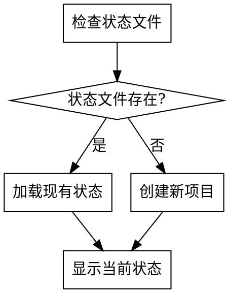
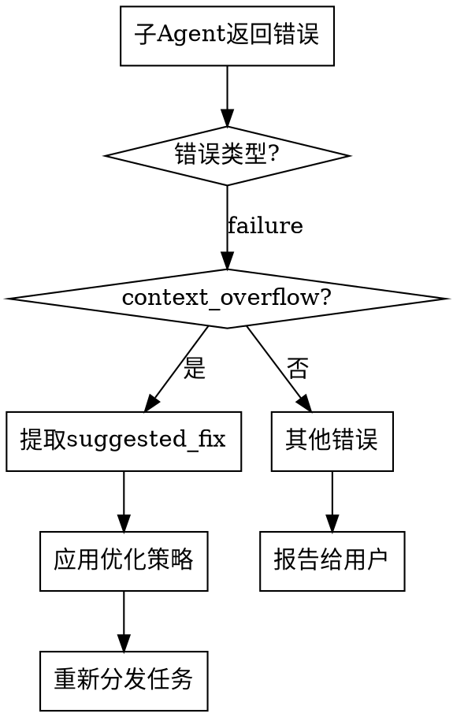

<SUBAGENT-STOP>
If you were dispatched as a subagent to execute a specific task, skip this skill.
</SUBAGENT-STOP>

# Using Writing Workflow

AI辅助小说创作工作流的主入口。管理整个创作流程，协调各阶段skill的执行。

## 触发条件

用户请求开始小说创作工作流时触发。关键词包括：
- "开始小说创作"
- "写作工作流"
- "创作小说"
- "writing-workflow"

## 工作流状态管理

工作流状态保存在 `novel-project/workflow-state.json`：

```json
{
  "current_stage": "work_type_selection",
  "completed_stages": [],
  "project_info": {
    "work_type": null,
    "platform": null,
    "genre": null,
    "title": null
  },
  "files": {},
  "guardrails": {
    "continuity_mode": "strict",
    "latest_passed_chapter": 0,
    "latest_ai_path": null,
    "release_allowed": true,
    "monetization_allowed": true,
    "latest_drift_score": null,
    "latest_context_card": null,
    "latest_continuity_ledger": "novel-project/17-continuity/continuity-ledger.md"
  },
  "statistics": {
    "total_chapters": 0,
    "total_words": 0,
    "last_updated": null
  }
}
```

## 阶段定义

| 阶段ID | 阶段名称 | 对应Skill | 说明 |
|--------|----------|-----------|------|
| work_type_selection | 作品类型选择 | work-type-selection | 选择适合的作品类型 |
| platform_research | 平台调研 | platform-research | 调研平台数据、签约政策 |
| competitor_analysis | 竞品分析 | competitor-analysis | 深度拆解同赛道头部作品 |
| genre_selection | 题材选择 | genre-selection | 选择创作题材 |
| novel_confirmation | 作品确认 | novel-confirmation | 确定作品基本信息 |
| creation_planning | 创作规划 | creation-planning | 制定创作计划 |
| outline_writing | 大纲生成 | outline-writing | 生成世界观和大纲 |
| chapter_outline | 章节细纲 | chapter-outline | 生成章节细纲 |
| content_generation | 正文生成 | content-generation | 生成正文内容（含平台算法适配） |
| human_ai_collaboration | AI合规处理 | human-ai-collaboration | 人机协作流程，确保内容过审 |
| quality_review | 质量审查 | quality-review | 多维度质量审查 |
| launch_strategy | 上架发布 | launch-strategy | 存稿管理、签约、首秀准备 |
| monetization_strategy | 变现策略 | monetization-strategy | VIP/付费卡点/收益优化 |
| opening_optimization | 开篇优化 | opening-optimization | 黄金三章优化（可选） |
| novel_style_learning | 网文风格学习 | novel-style-learning | 学习网文风格（可选） |
| data_monitoring | 数据监控 | data-monitoring | 监控运营数据+数据→内容闭环（发布后） |
| reader_interaction | 读者互动 | reader-interaction | 管理读者关系（发布后） |

## PUA Skill 集成

本工作流集成了 pua skill 进行AI行为监督，在以下情况下自动触发：

### 触发条件
1. **连续失败**：某个阶段执行失败2次以上
2. **用户不满意**：用户表达"再试试"、"换个方法"、"为什么还不行"等情绪
3. **创作卡顿**：生成内容质量明显下降或无法继续
4. **上下文超限**：子agent因上下文问题无法完成任务

### 触发方式
当检测到以上情况时，调用 `pua:pua` skill：

```
检测到创作过程遇到困难，正在启动AI行为监督...
[调用 pua:pua skill]
```

### 监督内容
- 分析失败原因
- 提供优化方案
- 强制AI尝试更多解决方案
- 不允许轻易放弃

### 降级规则（pua Skill 不存在时）

若 `pua:pua` 不可用（未安装 superpowers 或相关插件），**跳过该分支**，改为直接向用户说明。

**非质量关键阶段**（work_type_selection, platform_research, competitor_analysis, genre_selection, novel_confirmation, creation_planning）：
```
当前阶段遇到困难，需要您决定下一步：

1. 重新尝试（Claude 使用不同方式重试）
2. 跳过此阶段，进入下一阶段
3. 退出工作流，稍后继续
```

**质量关键阶段**（outline_writing, chapter_outline, content_generation, quality_review, human_ai_collaboration）：
```
当前阶段遇到困难，需要您决定下一步：

1. 重新尝试（Claude 使用不同方式重试）
2. 手动修改后重新审查
3. 保存当前进度，稍后继续
```

> ⚠️ 质量关键阶段不提供"跳过"选项，与质量门禁规则保持一致。

不抛出错误，不尝试调用不存在的 Skill。

## 执行流程

### 1. 初始化检查



### 2. 主循环

```
while (用户未退出) {
    显示当前阶段和可选操作
    获取用户选择
    执行对应操作
    更新工作流状态
    检查是否需要质量审查
}
```

### 3. 用户交互

每次阶段完成后，使用AskUserQuestion确认下一步：

**非质量关键阶段**（work_type_selection, platform_research, competitor_analysis, genre_selection, novel_confirmation, creation_planning）：
```
当前阶段：[阶段名称] 已完成

可选操作：
1. 继续下一阶段
2. 重新执行当前阶段
3. 跳过此阶段，进入下一阶段
4. 跳到指定阶段
5. 查看当前进度
6. 保存并退出
```

> 💡 以下阶段为**质量关键阶段**，必须通过质量检查才能继续，不可跳过。这是为了确保作品达到平台发布标准。

**质量关键阶段**（outline_writing, chapter_outline, content_generation, quality_review, human_ai_collaboration）：
```
当前阶段：[阶段名称] 已完成

质量检查结果：[通过/未通过]

可选操作：
1. 继续下一阶段（仅质量检查通过时可选）
2. 重新执行当前阶段
3. 查看质量审查报告
4. 手动修改后重新审查
5. 查看当前进度
6. 保存并退出
```

> ⚠️ 质量关键阶段不提供"跳过"选项。必须通过质量检查才能进入下一阶段。
> 唯一例外：短篇用户可跳过 platform_research 和 competitor_analysis。

> ⚠️ 质量门禁最大重试次数：同一阶段连续3次未通过质量检查后，暂停工作流并提示用户：
>
> ```
> 当前阶段已连续3次未通过质量检查。建议：
> 1. 查看历次审查报告，分析共性问题
> 2. 手动大幅修改后重新提交
> 3. 回退到上一阶段（如修改细纲/大纲后重新生成）
> 4. 保存进度，寻求外部帮助后继续
> ```

## 阶段跳转规则

- **顺序执行**：默认按阶段顺序执行
- **跳过阶段**：用户可选择跳过非关键阶段
- **重新执行**：用户可重新执行任意已完成阶段
- **依赖检查**：跳转到某阶段前检查其依赖是否满足

## 依赖关系

```
work_type_selection
    └── platform_research
            ├── competitor_analysis (竞品分析)
            └── genre_selection
                    └── novel_confirmation
                            └── creation_planning
                                    └── outline_writing
                                            └── chapter_outline
                                                    └── content_generation
                                                            ├── human_ai_collaboration (AI合规)
                                                            ├── quality_review (质量审查)
                                                            ├── opening_optimization (前三章优化)
                                                            └── novel_style_learning (风格学习)

发布运营阶段：
content_generation ──┬── launch_strategy (上架发布策略)
                     │       └── monetization_strategy (变现策略)
                     ├── data_monitoring (数据监控+闭环)
                     └── reader_interaction (读者互动)
```

**阶段说明**：
- `competitor_analysis`：平台确定后、题材选择前执行，为选题和写作提供差异化方向
- `human_ai_collaboration`：每章正文生成后自动触发，确保AI合规
- `launch_strategy`：正文存稿达标后执行，制定发布策略
- `monetization_strategy`：上架策略确定后执行，制定变现计划
- `data_monitoring`：作品发布后持续执行，数据异常自动触发内容优化
- `opening_optimization`：前三章完成后自动建议执行
- `novel_style_learning`：可在任何阶段执行
- `reader_interaction`：作品发布后持续执行

## 文件管理

### 创建项目目录

```bash
mkdir -p novel-project/06-chapter-outlines
mkdir -p novel-project/07-content
mkdir -p novel-project/08-characters
mkdir -p novel-project/09-worldbuilding
mkdir -p novel-project/10-reviews/quality-reports
mkdir -p novel-project/17-continuity
```

### 状态更新

每次阶段完成后更新 `workflow-state.json`：
- 添加到 `completed_stages`
- 更新 `current_stage`
- 更新 `project_info` 相关字段
- 更新 `files` 映射
- 更新 `guardrails`：
  - `latest_passed_chapter`：最近通过看护流程的章节号
  - `latest_ai_path`：最近一次合规评估的 A/B/C 路径
  - `release_allowed`：是否允许进入上架发布阶段
  - `monetization_allowed`：是否允许进入变现策略阶段
  - `latest_drift_score`：最近一章的偏离度
  - `latest_context_card`：当前章节看护卡路径
  - `latest_continuity_ledger`：连续性账本路径
- 更新 `last_updated` 时间戳

## 正文看护流程

正文生成和质量审查阶段必须执行以下看护链路，目标是减少大纲偏离、细纲偏离和上下文断裂：

```text
大纲阶段：
  生成 continuity story bible（不可变更事实、时间线锚点、人物初始状态、关键伏笔）

细纲阶段：
  为每章生成 chapter context card（本章起点状态、必写场景、禁止偏离项、章末交接状态）

正文阶段：
  先读取 story bible + chapter context card + 前章连续性账本
  再按场景顺序逐段生成，禁止跳过必写场景或随意新增设定

审查阶段：
  先做连续性硬门槛检查，再做人物/文风/平台适配评分
```

### 连续性硬门槛

出现以下任一情况时，正文视为**未通过**，不得继续下一阶段：

1. 场景覆盖率低于 90%
2. 偏离度高于 15%
3. 前后章时间线、地点、人物状态存在硬冲突
4. 本章 context card 中的必写信息缺失
5. 未经说明擅自新增关键设定、人物关系或世界规则

### 允许的有限偏离

以下偏离可以接受，但必须在本章自检和审查报告中解释原因：

- 细节扩写但不改变场景功能
- 衔接过渡补写
- 为增强连贯性添加的微小动作、情绪、环境信息

> 原则：允许“补充”，不允许“改轨”。

## 错误处理

| 错误类型 | 处理方式 |
|----------|----------|
| 状态文件损坏 | 提示用户重建或手动修复 |
| 阶段执行失败 | 提供重试/跳过/退出选项 |
| 文件读写错误 | 检查权限，提供解决方案 |
| 上下文超限 | 触发上下文压缩机制 |

## 子Agent上下文超限处理

当子agent返回 `context_overflow` 错误时，不直接重试，而是优化后重试：

### 处理流程



### 优化策略

1. **减少上下文**：移除 `suggested_fix.reduce_context` 中的可选文件
2. **分批处理**：按 `suggested_fix.split_task.suggested_batches` 分批执行
3. **使用摘要**：将完整文件替换为摘要版本

### 示例代码

```python
# 伪代码示例
def handle_subagent_error(error):
    if error.get("error_type") == "context_overflow":
        fix = error.get("suggested_fix", {})

        # 策略1：减少上下文
        if fix.get("reduce_context"):
            context_files = [f for f in context_files
                           if f not in fix["reduce_context"]]

        # 策略2：分批处理
        if fix.get("split_task"):
            batches = fix["split_task"]["suggested_batches"]
            for batch in batches:
                result = dispatch_to_subagent(batch)
                if result["status"] == "failure":
                    return handle_subagent_error(result)
            return {"status": "success"}

        # 策略3：使用摘要模式
        context_priority = "summary"
        return dispatch_to_subagent(context_priority="summary")

    else:
        # 其他错误报告给用户
        report_error_to_user(error)
```

### 最大重试次数

每种优化策略最多重试2次，超过后报告给用户。

## 示例对话

```
AI: 欢迎使用小说创作工作流！

检测到已有项目：[项目名称]
当前阶段：大纲生成
已完成：平台调研、题材选择、作品确认、创作规划

请选择：
1. 继续大纲生成
2. 查看项目详情
3. 重新执行某阶段
4. 开始新项目

用户: 1

AI: 正在调用 outline-writing skill...
[执行大纲生成]
```

## 注意事项

- 所有决策必须与用户确认
- 阶段间数据通过文件传递
- 质量检查在关键节点自动触发
- 支持断点续传，可随时保存退出
