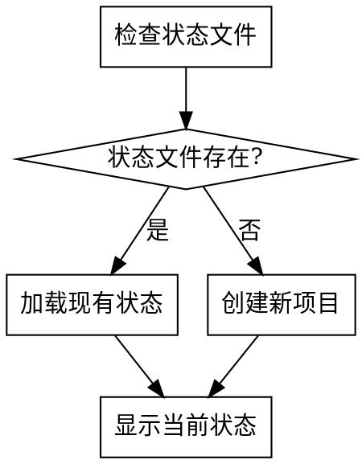
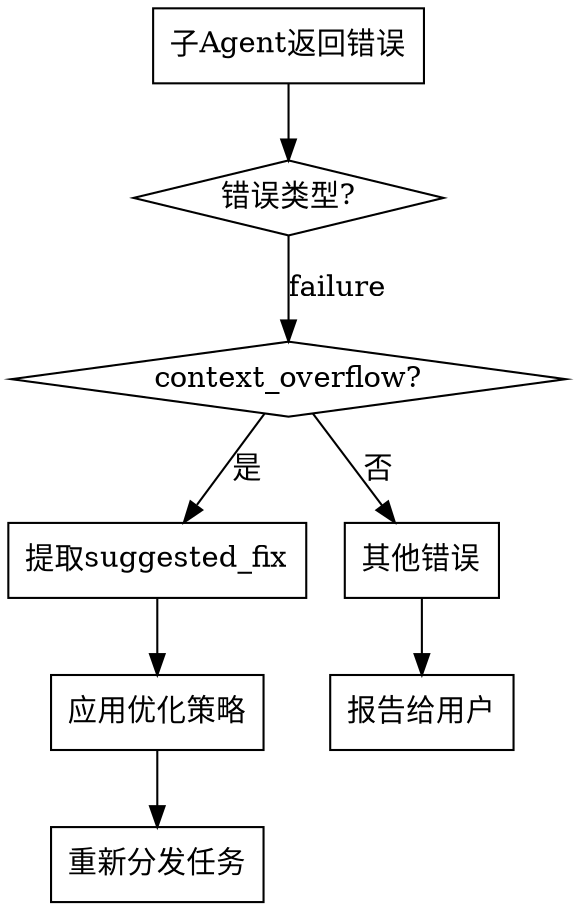

<SUBAGENT-STOP>
If you were dispatched as a subagent to execute a specific task, skip this skill.
</SUBAGENT-STOP>

# Using Writing Workflow

AI辅助小说创作工作流的主入口。管理整个创作流程，协调各阶段skill的执行。

## 触发条件

用户请求开始小说创作工作流时触发。关键词包括：
- "开始小说创作"
- "写作工作流"
- "创作小说"
- "writing-workflow"

## 工作流状态管理

工作流状态保存在 `novel-project/workflow-state.json`：

```json
{
  "current_stage": "work_type_selection",
  "completed_stages": [],
  "project_info": {
    "work_type": null,
    "platform": null,
    "genre": null,
    "title": null
  },
  "files": {},
  "statistics": {
    "total_chapters": 0,
    "total_words": 0,
    "last_updated": null
  }
}
```

## 阶段定义

| 阶段ID | 阶段名称 | 对应Skill | 说明 |
|--------|----------|-----------|------|
| work_type_selection | 作品类型选择 | work-type-selection | 选择适合的作品类型 |
| platform_research | 平台调研 | platform-research | 调研平台数据、签约政策 |
| genre_selection | 题材选择 | genre-selection | 选择创作题材 |
| novel_confirmation | 作品确认 | novel-confirmation | 确定作品基本信息 |
| creation_planning | 创作规划 | creation-planning | 制定创作计划 |
| outline_writing | 大纲生成 | outline-writing | 生成世界观和大纲 |
| chapter_outline | 章节细纲 | chapter-outline | 生成章节细纲 |
| content_generation | 正文生成 | content-generation | 生成正文内容 |
| opening_optimization | 开篇优化 | opening-optimization | 黄金三章优化（可选） |
| novel_style_learning | 网文风格学习 | novel-style-learning | 学习网文风格（可选） |
| data_monitoring | 数据监控 | data-monitoring | 监控运营数据（发布后） |
| reader_interaction | 读者互动 | reader-interaction | 管理读者关系（发布后） |

## PUA Skill 集成

本工作流集成了 pua skill 进行AI行为监督，在以下情况下自动触发：

### 触发条件
1. **连续失败**：某个阶段执行失败2次以上
2. **用户不满意**：用户表达"再试试"、"换个方法"、"为什么还不行"等情绪
3. **创作卡顿**：生成内容质量明显下降或无法继续
4. **上下文超限**：子agent因上下文问题无法完成任务

### 触发方式
当检测到以上情况时，调用 `pua:pua` skill：

```
检测到创作过程遇到困难，正在启动AI行为监督...
[调用 pua:pua skill]
```

### 监督内容
- 分析失败原因
- 提供优化方案
- 强制AI尝试更多解决方案
- 不允许轻易放弃

## 执行流程

### 1. 初始化检查



### 2. 主循环

```
while (用户未退出) {
    显示当前阶段和可选操作
    获取用户选择
    执行对应操作
    更新工作流状态
    检查是否需要质量审查
}
```

### 3. 用户交互

每次阶段完成后，使用AskUserQuestion确认下一步：

```
当前阶段：[阶段名称] 已完成

可选操作：
1. 继续下一阶段
2. 重新执行当前阶段
3. 跳到指定阶段
4. 查看当前进度
5. 保存并退出
```

## 阶段跳转规则

- **顺序执行**：默认按阶段顺序执行
- **跳过阶段**：用户可选择跳过非关键阶段
- **重新执行**：用户可重新执行任意已完成阶段
- **依赖检查**：跳转到某阶段前检查其依赖是否满足

## 依赖关系

```
work_type_selection
    └── platform_research
            └── genre_selection
                    └── novel_confirmation
                            └── creation_planning
                                    └── outline_writing
                                            └── chapter_outline
                                                    └── content_generation
                                                            └── opening_optimization (前三章优化)
                                                            └── novel_style_learning (风格学习)

发布后阶段：
content_generation ──┬── data_monitoring (数据监控)
                    └── reader_interaction (读者互动)
```

**阶段说明**：
- `opening_optimization`：前三章完成后自动建议执行，对首秀成败至关重要
- `novel_style_learning`：可在任何阶段执行，帮助理解网文风格
- `data_monitoring`：作品发布后定期执行，监控运营数据
- `reader_interaction`：作品发布后持续执行，管理读者关系

## 文件管理

### 创建项目目录

```bash
mkdir -p novel-project/06-chapter-outlines
mkdir -p novel-project/07-content
mkdir -p novel-project/08-characters
mkdir -p novel-project/09-worldbuilding
mkdir -p novel-project/10-reviews/quality-reports
```

### 状态更新

每次阶段完成后更新 `workflow-state.json`：
- 添加到 `completed_stages`
- 更新 `current_stage`
- 更新 `project_info` 相关字段
- 更新 `files` 映射
- 更新 `last_updated` 时间戳

## 错误处理

| 错误类型 | 处理方式 |
|----------|----------|
| 状态文件损坏 | 提示用户重建或手动修复 |
| 阶段执行失败 | 提供重试/跳过/退出选项 |
| 文件读写错误 | 检查权限，提供解决方案 |
| 上下文超限 | 触发上下文压缩机制 |

## 子Agent上下文超限处理

当子agent返回 `context_overflow` 错误时，不直接重试，而是优化后重试：

### 处理流程



### 优化策略

1. **减少上下文**：移除 `suggested_fix.reduce_context` 中的可选文件
2. **分批处理**：按 `suggested_fix.split_task.suggested_batches` 分批执行
3. **使用摘要**：将完整文件替换为摘要版本

### 示例代码

```python
# 伪代码示例
def handle_subagent_error(error):
    if error.get("error_type") == "context_overflow":
        fix = error.get("suggested_fix", {})

        # 策略1：减少上下文
        if fix.get("reduce_context"):
            context_files = [f for f in context_files
                           if f not in fix["reduce_context"]]

        # 策略2：分批处理
        if fix.get("split_task"):
            batches = fix["split_task"]["suggested_batches"]
            for batch in batches:
                result = dispatch_to_subagent(batch)
                if result["status"] == "failure":
                    return handle_subagent_error(result)
            return {"status": "success"}

        # 策略3：使用摘要模式
        context_priority = "summary"
        return dispatch_to_subagent(context_priority="summary")

    else:
        # 其他错误报告给用户
        report_error_to_user(error)
```

### 最大重试次数

每种优化策略最多重试2次，超过后报告给用户。

## 示例对话

```
AI: 欢迎使用小说创作工作流！

检测到已有项目：[项目名称]
当前阶段：大纲生成
已完成：平台调研、题材选择、作品确认、创作规划

请选择：
1. 继续大纲生成
2. 查看项目详情
3. 重新执行某阶段
4. 开始新项目

用户: 1

AI: 正在调用 outline-writing skill...
[执行大纲生成]
```

## 注意事项

- 所有决策必须与用户确认
- 阶段间数据通过文件传递
- 质量检查在关键节点自动触发
- 支持断点续传，可随时保存退出
